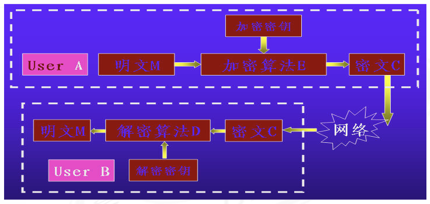
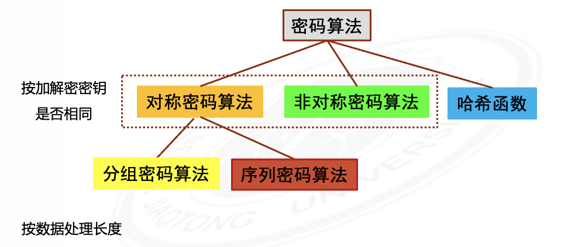
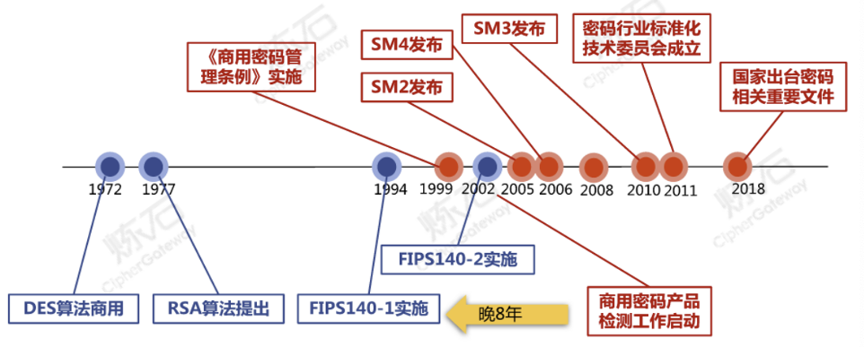
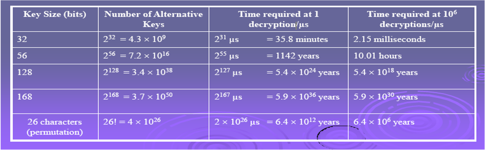

# 密码学

*Author: ZhaoLulu@BJTU*

*Teacher: LiLin@BJTU*

*Date: 2021.9.8*

## 第0章 课程介绍

### 0.1 教学目标

密码技术是信息安全与保密的关键技术之一，也是其他信息安全与保密技术的基础。

- 掌握密码学的基本概念、基本原理、基本思想与基本方法。
- 掌握国内外典型密码算法和密码学的应用技术。
- 具备典型密码的软件开发能力和密码应用能力。

### 0.2 课程内容

1. 密码学概述
2. 相关数学知识
3. 古典密码
4. 分组密码
5. 序列密码
6. 随机数产生
7. 公钥密码
8. 哈希函数
9. 消息认证
10. 数字签名
11. 密钥管理与分发
12. 用户认证

### 0.3 课程安排

- 上课时间：周二 8:00-9:50 SX402 周五 10:00-12:20 SX402
- 实验：7-8次
- 专题报告+展示：第15周 SX402
- 考试：期中+期末
- 作业

### 0.4 课程考核

总成绩 = 平时成绩（期中考试、作业、实验、报告/答辩、考勤）50% + 期末考试50%

### 0.5 实验课和作业要求

- 作业提交时间：每周讲课后的下周二上课时间
- 实验报告提交截止时间：实验周日晚24点（以邮件系统时间为准）
- 实验报告命名：学号_实验1.rar

## 第1章 密码学概述

### 1.1 信息安全事件与密码法

- 2018年8月28日，华住旗下酒店客户信息泄露。
- 2017年5月12日，Wannacry勒索软件蠕虫在互联网上大范围传播，我国大量行业企业内网大规模感染，包括企业、医疗、电力、能源、银行、交通等多个行业均遭受不同程度影响。
- 2021年6月30日，滴滴在美国纽交所上市。2021年7月2日，滴滴迎来国家网信办网络安全审查办公室的网络安全审查。2021年7月4日，滴滴出行因APP存在严重违法违规手机使用个人信息问题，被国家互联网信息办公室依据《中华人民共和国网络安全法》相关规定下架。
- 2019年10月26日，十三届全国人大常委会第十四次会议通过《中华人民共和国密码法》，定于2020年1月1日起施行。密码是国家重要战略资源，是保障网络语信息安全的核心技术和基础支撑。密码工作是党和国家的一项特殊重要工作，直接关系国家政治安全、经济安全、国防安全和信息安全。

### 1.2 什么是密码？

- 密码是一种用来混淆的技术，它希望将正常的、可识别的信息转变为无法识别的信息。
- 密码是指使用**特定变换**对数据等信息进行**加密保护**或者**安全认证**的物项和技术。（密码法中的表述）
  - 加密保护是指使用特定变换将原始信息变成攻击者不能识别的符号序列，从而保护信息的机密性。
  - 安全认证是指使用特定变换，确认信息是否被篡改、来自可靠信息源以及确认信息发送行为是否真实存在等，从而保护信息来源的真实性、数据的完整性和行为的不可否认性。
  - 物项是指实现加密保护或安全认证功能的设备与系统。
  - 技术是指利用物项实现加密保护或安全认证功能的方法或手段。

### 1.3 什么是密码学？

- 密码学是一个既古老又新兴的学科，它研究信息在系统中如何表示，如何针对这个表示计算其被破解代价的学问。

- 密码学被分类成密码编码学（Crypyography）和密码分析学（Cryptanalytics）。密码学在这两个相互对立、相互促进的问题中发展起来。

### 1.4 密码的主要功能

| 功能       | 内容                                                         |
| ---------- | ------------------------------------------------------------ |
| 机密性     | 保证信息不被泄露给非授权的个人、计算机等实体的性质。         |
| 完整性     | 数据没有收到非授权的篡改或破坏的性质。                       |
| 不可否认性 | 也称抗抵赖性，指一个已经发生的操作行为无法否认的性质。       |
| 真实性     | 信息来源的真实性是指保证信息来源可靠、没有被伪造和篡改的性质；身份真实性是指信息收发双方的身份与声称的相一致。 |

### 1.5 基本术语

- 消息被称为**明文 (Plaintext)**。
- 用某种方法伪装消息以隐藏它的内容的过程称为**加密 (Encryption)**。
- 消息被加密后得到的信息称之为**密文 (Ciphertex)**。
- 把密文转变为明文的过程称为**解密 (Decryption)**。
- 对明文进行加密操作的人员称为**加密员或密码员 (Cryptographer)**。
- 加密和解密算法的操作通常都是在一组密钥的控制下进行的，分别称为**加密密钥 (Encryption Key)**和**解密密钥 (Decryption Key)**。
- **密码算法 (Cryptography Algorithm)**是用于加密和解密的数学函数。
- 密码员对明文进行加密操作时所采用的一组规则称作**加密算法 (Decryption Algorithm)**。
- 所传送信息的预定对象称为**接收者 (Receiver)**。
- 接收者对密文解密所采用的的一组规则称为**解密算法 (Decryption Algorithm)**。
- **破译者 (Codebreakers)**。

### 1.6 加密通信的模型



密码学的目的是User A和User B两个人在不安全的信道上进行通信，而破译者不能理解他们通信的内容。

### 1.7 密码体制的定义

一个密码是满足以下条件的五元组$(P,C,K,E,D)$：

1. $P$表示所有可能的明文组成的有限集；
2. $C$表示所有可能的密文组成的有限集；
3. $K$代表密钥空间，有所有可能的密钥组成的有限集；
4. 对任意的$k \in K$，都存在一个加密法则$e_k \in E$和相应的解密法则$d_k \in D$。并且对每一个$e_k : P \to C, d_k: C \to P$，对任意的明文$x \in P$，均有$d_k(e_k(x)) = x$。

### 1.8 实用密码体制需要满足的基本条件

- 有效性：每个加密函数$e_k$和每个解密函数$d_k$应当能被有效地计算。
- 安全性：即使看到密文串$y$，窃听者$Oscar$确定所用的密钥$k$或明文串$x$是不可行的。

### 1.9 密码体制的分类



- 基于密钥的算法，按照密钥的特点可以分类：
  - **对称密码算法 (symmetric cipher)**：又称为传统密码算法 (conventional cipher)，就是加密密钥和解密密钥相同，或实质上相同，即从一个易于推出另一个，又称秘密密钥算法或单密钥算法。
    1. 优点：效率高、算法简单、适合加密大量数据
    2. 缺点：需要安全的密钥交换、用户多时密钥量大
  - **非对称密码算法 (asymmetric cipher)**：加密密钥和解密密钥不相同，从一个很难推出另一个，又称公开密钥算法 (public-key cipher)。
    1. 优点：不需要安全的密钥交换、解决了密钥管理的问题
    2. 缺点：效率较低、不适合加密大量数据、密钥产生较麻烦
  - 混合系统 = 非对称密码算法 + 对称密码算法
- 按照明文的处理方法可以分类：
  - **分组密码 (block cipher)**：将明文分成固定长度的组，用同一密钥和算法对每一块加密，输出也是固定长度的密文。
  - **流密码 (stream cipher)**：又称为序列密码。序列密码每次加密一位或一字节的明文，通常也被称为流密码。

### 1.10 密码学的起源和发展

- 古代加密算法（手工阶段）
- 古典密码学（机械阶段）
- 现代密码学（计算机阶段）

### 1.11 我国密码的发展历程

- 我国的密码体系起步晚于美国，但可借鉴先进经验。
- 我国密码算法研制跟国际密码算法研制水平相当，但密码产业特别是密码应用方面存在近20年差距。



### 1.12 密码分析 (Cryptanalysis)

- 目的在于复原密钥而非仅仅是明文。
- 常用手段包括：密码破译 (Cryptanalytic Attack)、暴力攻击 (Brute-force Attack)。
- 如果密码分析成功则所有密钥的使用都是危险的。

### 1.13 密码破译 (Cryptanalytic Attack)

- Kerckhoff原则：假设破译者Oscar是在已知密码体制的前提下来破译Bob使用的密钥。
- 常见的破解类型包括
  - 唯密文攻击：Oscar具有密文串$y$
  - 已知明文攻击：Oscar具有明文串$x$和相应的密文$y$。
  - 选择明文攻击：Oscar可获得对加密机的暂时访问，因此他能选择明文$x$并构造出相应的密文串$y$。
  - 选择密文攻击：Oscar可暂时接近密码机，可选择密文串$y$，并构造出相应的明文串$x$。
- 破译方法：归纳与演绎
- 破译步骤：分析、假设、推测、证实
- 破译三大要素
  - 语言的频率特征：e
  - 语言的连接特征：q, u, l, e, x
  - 语言的重复特征：th, tion, tious

### 1.14 暴力攻击 (Brute-force Attack)



### 1.15 密码算法的安全性

- 计算安全性 (Computationally Secure)

  - 攻破密体制所需要的付出的计算代价查过信息本身价值或付出的时间超出信息有效期。

  - 没有一个已知的实际密码体制能够在这个定义下被证明安全。

- 可证明安全 (Provable Security)

  - 可以证明一类命题：如果给定的整数$n$不可分解，那么给定的密码体制是不可破解的，这种类型的密码体制是可证明安全的。

- 无条件安全 (Unconditionally Secure)

  - 即使提供了无穷的计算资源也无法被破解的密码体制称为无条件安全。
  - 无论破译者有多少米文也无法解出明文或无法验证结果正确性。
  - 一次一密乱码本 (Onetime Pad)、量子密码。

### 1.16 密码学研究的基本问题

1. 密码体制相关概念
2. 单向函数和伪随机序列生成器
3. 数字签名和杂凑函数
4. 消息认证和身份识别
5. 各类密码协议（如密钥签发、秘密共享、零知识证明）

### 1.17 密码学的应用

1. 军事外交等机要通信
2. 电子政务、电子商务
3. 金融证券
4. 物联网、工业互联网、车辆网
5. 区块链技术

## 第2章 数论基础

### 2.1 初等数论

初等数论 (Elementary Number Theory) 以整数的整除性为中心，包括整除性、不定方程、同余式、连分数、素数分布及数论函数等内容。

### 2.2 整除性

#### 2.2.1 定义

设$a,b$是任意两个整数，其中$b \neq 0$，如果存在一个整数$m$使得等式
$$
a = bm
$$
成立，我们就说$b$整除$a$或$a$可被$b$整除，记作$b \mid a$，此时我们把$b$叫作$a$的因数，把$a$叫作$b$的倍数。如果整数$m$不存在，我们就说$b$不能整除$a$或$a$不被$b$整除，记作$b \nmid a$。

#### 2.2.2 性质

- if $a \mid 1$, then $a = \pm 1$.
- if $a \mid b$, and $b \mid a$, then $a = \pm b$.
- any $b \neq 0$ divies $0$.
- if $a \mid b$ and $b \mid c$, then $a \mid c$.
- if $b \mid g$ and $b \mid h$, then $b \mid (mg + nh)$ for arbitrary integers $m$ and $n$.

### 2.3 带余除法

#### 2.3.1 定理

- 若$a,n$是两个整数，其中$n > 0$，则存在两个整数$q, r$使得

$$
a = nq + r, 0 \le r < n; q = \lfloor \dfrac{a}{n} \rfloor
$$

成立，而且$q, r$是唯一的。其中$q$叫作不完全商，$r$叫作余数。

#### 2.3.2 证明

- 存在性：做整数序列$\dots,-3n,-2n,-n,0,n,2n,3n,\dots$，则$a$必在上述序列的某两项之间，即存在一个整数$q$使得$qn \le a < (q+1)n$成立。令$a - nq = r$，则$a = nq + r$，而$0 \le r < n$。
- 唯一性：设$q_1,r_1$是满足等式的两个整数，则有$a = nq_1 + r_1, 0 \le r_1 < n$，因而$nq_1 + r_1 = nq + r$，于是$n(q-q_1) = r_1 - r$，故$n |q - q_1| = |r_1 - r|$，由于$r$与$r_1$都是小于$n$的整数，所以上式右边小于$n$。如果$q \neq q_1$则上式左边$\ge n$，矛盾。因此$q = q_1, r = r_1$。

#### 2.3.3 整数分类

- 设$a > 0$，任一整数被$a$整除后所得的最小非负余数是且仅是$0, 1, \dots, a - 1$这$a$个数中的一个。
- 设$a \ge 2$是给定的正整数，$j = 0, 1, \dots, a - 1$。对于给定的$j$，被$a$除后余数等于$j$的全体整数是$ka + j, k = 0, \pm 1, \pm 2, \dots$这些整数组成的集合记为$j \, mod \, a$。当$0 \le j \neq j^{'} \le a -1$时，$j \, mod \, a$和$j^{'} \, mod \, a$不相交，以及并集$0 \, mod \, a \,  \cup \, \dots \, \cup \, (a - 1) \, mod \, a = \mathbb{Z}$，即全体整数被$a$除后所得的最小非负余数来分类，分为了两两不相交的$a$个类。

#### 2.3.4最大公因数与互素

- 定义：两个整数$a, b$的最大公因数$c > 0$满足：

1. $c$是$a, b$的公因数，即$c \mid a, c \mid b$。
2. $a, b$任意公因数均是$c$的因数，即如果$d \mid a, d \mid b$则$d \mid c$。

$a,b$的最大公因数记作$gcd(a,b)$。如果$gcd(a,b) = 1$则说$a,b$互素，有时记为$a \perp b$。

- 性质：
  - $gcd(a,b) = gcd(b,a) = gcd(a, -b) = gcd(-a,-b) = gcd(|a|, |b|) = gcd(a,a-b)$
  - $gcd(0,a) = a$
- 求解方法：
  - 因数分解法
  - 欧几里得算法（辗转相除法、更相减损术） 

```java
public static long gcd(long a, long b) {
    return a % b == 0 ? b : gcd(b, a % b);
}
```

### 2.4 模运算

#### 2.4.1 定义

设$n$是一正整数，$a$是整数，如果用$n$除$a$，得商为$q$，余数为$r$，则
$$
a = qn + r, 0 \le r < n, q = \lfloor \dfrac{a}{n} \rfloor
$$
其中$\lfloor x \rfloor$为小于或等于$x$的最大整数。用$a \, mod \, n$表示余数$r$，则$a = \lfloor \dfrac{a}{n} \rfloor n + a \, mod \, n$。

#### 2.4.2 模算术运算

1. $[(a \, mod \, n) + (b \, mod \, n)]\, mod \, n = (a + b) \, mod \, n$
2. $[(a \, mod \, n) - (b \, mod \, n)]\, mod \, n = (a - b) \, mod \, n$
3. $[(a \, mod \, n) \times (b \, mod \, n)]\, mod \, n = (a \times b) \, mod \, n$

#### 2.4.3 性质

一般地，定义$Z_n$为小于$n$的所有非负整数集合，即$Z_n = \{ 0, 1, \dots, n - 1 \}$，称$Z_n$为模$n$的同余类集合。其上的模运算有以下性质：

1. 交换律 $(w+x)\,mod\,n=(x+w)\,mod\,n \\ (w\times x)\,mod\,n=(x\times w)\,mod\,n$
2. 结合律 $[(w+x)+y]\,mod\,n=[w+(x+y)]\,mod\,n \\ [(w\times x)\times y]\,mod\,n=[w\times (x\times y)\,mod\,n]$
3. 分配律 $[w\times (x+y)]\,mod\,n=[w\times x+w\times y]\,mod\,n$
4. 单位元 $(0+w)\,mod\,n=w\,mod\,n \\ (1\times w)\,mod\,n=w\,mod\,n$
5. 加法逆元 对$w\in Z_n$，存在$z\in Z_n$，使得$w+z\equiv 0\,mod\,n$，记作$z=-w$。
6. 加法可约律（消去律）$(a+b)\equiv (a+c)\,mod \,n$，则$b\equiv c \,mod\,n$。
7. 设$a \in Z_n,gcd(a,n)=1$，则$a$在$Z_n$中有乘法逆元。设$p$为一素数，则$Z_p$中每一个非零元素都与$p$互素，因此有乘法逆元。

**$Z_m$关于其上定义的加法运算构成一个阿贝尔群，构成环。**

### 2.5 同余

#### 2.5.1 定义

如果$(a \, mod \, n) = (b \, mod \, n)$，则称两整数$a$和$b$模$n$同余，记为$a \equiv b \, mod \, n$。称与$a$模$n$同余的数的全体为$a$的同余类，记为$[a]$，称$a$为这个同余类的表示元素。

如果$a \equiv 0 \, (mod \, n)$，则$n \mid a$。

#### 2.5.2 性质

1. 若$n \mid (a-b)$，则$a \equiv b \, mod \, n$。
2. $(a \, mod \, n) \equiv (b \, mod \, n)$，则$a \equiv b \,mod \, n$。
3. $a \equiv b \, mod \, n$，则$b \equiv a \, mod \, n$。
4. $a \equiv b \, mod \, n, b \equiv c \, mod \, n$，则$a \equiv c \, mod \, n$。

### 2.6 欧几里得算法

#### 2.6.1 求最大公因子

```java
public static long gcd(long a, long b) {
    return a % b == 0 ? b : gcd(b, a % b);
}
```

#### 2.6.2 求乘法逆元

如果$gcd(a,b)=1$，则$b$在$mod \, a$下有乘法逆元（不妨假设$b<a$），即存在一$x(x<a)$，使得$bx \equiv 1\, mod \,a$。推广的欧几里得算法先算出$gcd(a,b)$，当$gcd(a,b)=1$时，则返回$b$的逆元。

- 方法一

利用辗转相除法求出最大公因数，并倒推回$1=r_n=gcd(a,b)=ua+vb$的形式，从而求出乘法逆元。

- 方法二

| Extended Euclid (a, b)                                       |
| ------------------------------------------------------------ |
| 1. $(X_1,X_2,X_3)\gets(1,0,a);\,(Y_1,Y_2,Y_3)\gets(0,1,b)$;  |
| 2. if $Y_3=0$ then return $X_3=gcd(a,b)$; no inverse;        |
| 3. if $Y_3=1$ then return $Y_3=gcd(a,b)$; $Y_2=b^{-1}mod\,a$; |
| 4. $Q=\lfloor\frac{X_3}{Y_3}\rfloor$;                        |
| 5. $(T_1,T_2,T_3)\gets(X_1-QY_1,X_2-QY_2,X_3-QY_3)$;         |
| 6. $(X_1,X_2,X_3)\gets(Y_1,Y_2,Y_3)$;                        |
| 7. $Y_1,Y_2,Y_3\gets(T_1,T_2,T_3)$;                          |
| 8. go to 2.                                                  |

算法中变量有以下关系：

$aT_1+bT_2=T_3;\quad aX_1+bX_2=X_3;\quad aY_1+bY_2=Y_3$

如果$gcd(a,b)=1$，则在最后一轮循环中$Y_3=0,X_3=1$，因此在前一轮循环中$Y_3=1$。

即$aY_1+bY_2=1$，所以有$Y_2\equiv b^{-1}mod\,a$。

```java
public static int eGCD(int a, int b) {
    int[] x = {1, 0, a};
    int[] y = {0, 1, b};
    int[] t = new int[3];
    int q = 0;
    boolean flag = true;
    while (flag) {
        q = x[2] / y[2];
        for (int i = 0; i < 3; i++) {
            t[i] = x[i] - q * y[i];
            x[i] = y[i];
            y[i] = t[i];
        }
        if (y[2] == 1) {
            if (y[1] < 0) {
                y[1] += a;
            }
            return y[1];
        }
        if (y[2] == 0) {
            flag = false; //两数不互质时可以返回x[2]为最大公因数
        }
    }
    return 0;
}
```

### 2.7 素数

#### 2.7.1 定义

称整数$p(p>1)$是素数，如果$p$的因子只有$\pm 1,\pm p$。

#### 2.7.2 定理

任一整数$a(a>1)$都能惟一地分解为以下形式：
$$
a=p_1^{a_1}p_2^{a_2}\dots p_t^{a_t}
$$
其中$p_1>p_1>\dots >p_t$是素数，$a_i>0(i=1,2,\dots t)$。
