# 数据库系统原理

*Author: ZhaoLulu@BJTU*

*Teacher: LiuZhen@BJTU*

*Date: 2021.9.8*

## 第0章 课程介绍

### 0.1 什么是数据库

1. A Database is a collection of data that conforms with a data model.
2. Database models a real-world "enterprise" which includes entities and relationships.

### 0.2 为什么学习数据库

1. 数据库处于计算机科学的核心地位。
2. 数据库对社会各行各业都十分重要。
3. 数据库包含的知识丰富。
4. 数据库已成为信息工程的基础骨干。

### 0.3 谁使用数据库

- 行业用户
- DBMS产品提供商、开发人员
- 数据库应用开发者
- 数据库管理员DBAs

### 0.4 数据库的发展历程

1. 三代演变：层/网状模型、关系模型、新一代数据库系统家族。
2. 数据库领域有4位图灵奖得主。
3. 发展出一门计算机基础学科——数据建模和DSMS核心技术为主。
4. 带动了一门巨大的软件产业——DBMS及其相关工具产品、应用套件、解决方案。

### 0.5 如何学习数据库

- 需求驱动理论
- 理论指导实践
- 实践验证理论
- 实践发现需求

### 0.6 课程考核方式

总评成绩 = 平时成绩50分 + 期末考试50分

平时成绩 = 场景实例开发实验作业#1~#7 + 课设 + 习题

## 第1章 绪论

本章的主要内容如下：

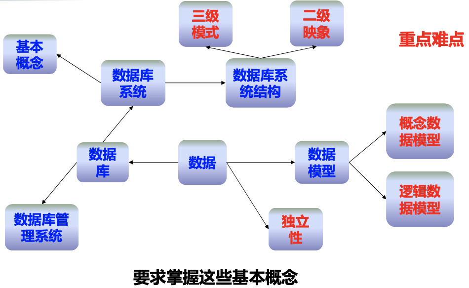

### 1.1 数据库系统概述

#### 1.1.1 数据库的地位

- 数据库技术产生于上世纪六十年代末，是数据管理的最新技术，是计算机科学的重要分支。
- 数据库技术是信息系统的核心和基础，它的出现极大地促进了计算机应用向各行各业的渗透。
- 数据库的建设规模、数据库信息量的大小和使用频度已经成为衡量一个国家信息化程度的重要标志。

#### 1.1.2 四个基本概念

- 数据Data
  - 定义：描述事物的符号记录。
  - 种类：文字、图形、图像、声音。
  - 特点：数据与其语义不可分割，数据的形式不能完全表达其内容。
  - 举例：（李明，男，1998，江苏，计算机系，2016）
  - 语义：学生姓名、性别、出生年份、籍贯、所在系别、入学时间
  - 解释：李明是个大学生，1998年出生，江苏人，2016年考入计算机系。
- 数据库Database (DB)
  - 定义：数据库是长期存放在计算机内、有组织的、可共享的数据集合。
  - 特点：数据库中的数据按一定的数据模型组织、描述和存储，且具有较小的冗余度、较高的数据独立性和易扩展性，可为多个用户共享。
- 数据库管理系统Database-management System (DBMS)
  - 定义：数据库管理系统是用于建立（如何定义、组织和存储数据）、使用（查询、插入、删除和修改数据）和维护（保证数据的安全性、完整性）数据库的软件。
  - 功能：数据库的建立；数据定义；数据组织、存储和管理；数据操纵；数据库事务和和运行管理；数据库维护。
  - 位置：位于用户和操作系统之间。
- 数据库系统Database System (DBS)
  - 定义：数据库系统是指在计算机系统中引入数据库之后的系统构成。
  - 构成：DB、DBMS及其开发工具、应用系统、数据库管理员和用户。
- 四者的关系

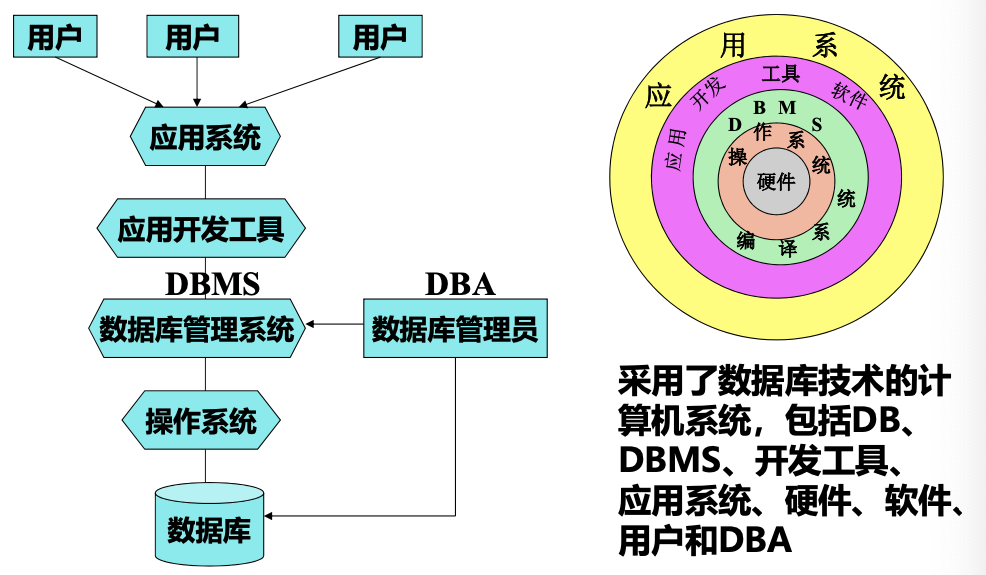

#### 1.1.3 数据库管理技术的产生和发展

- 数据处理：是指对各种形式的数据进行收集、储存、加工、管理和传播的一系列活动的总和。

- 数据管理：是指数据的分类、组织、编码、存储、维护、检索等操作，是数据处理的核心。

- 数据管理技术的发展动力：

  - 应用需求的推动
  - 计算机硬件的发展
  - 计算机软件的发展

- 数据管理技术的发展过程：

  |                  | 人工管理阶段（40年代中~50年代中）                            | 文件系统阶段（50年代末~60年代中）                            | 数据库系统阶段（60年代末~至今）                              |
  | ---------------- | ------------------------------------------------------------ | ------------------------------------------------------------ | ------------------------------------------------------------ |
  | 应用需求         | 科学计算                                                     | 科学计算、管理                                               | 大规模管理                                                   |
  | 硬件             | 只有磁带、卡片和纸带                                         | 磁盘、磁鼓等直接存取存储设备                                 | 大容量磁盘、磁鼓等直接存取存储设备                           |
  | 软件             | 只有汇编语言，无数据管理方面的软件，无操作系统               | 出现了高级语言和操作系统，OS中文件系统是专门管理外存的数据管理软件 | 有数据库管理系统                                             |
  | 数据处理         | 批处理                                                       | 批处理、联机实时处理                                         | 联机实时处理、分布处理、批处理                               |
  | 特点             | 数据不长期保存；应用程序管理数据；数据不具有独立性；数据不共享 | 数据可长期保存；由文件系统管理数据；数据共享性差，冗余度大；数据独立性差 | 数据结构化；数据共享性高，冗余度低，易扩充；数据独立性高；数据有DBMS统一管理和控制 |
  | 与应用程序的关系 | 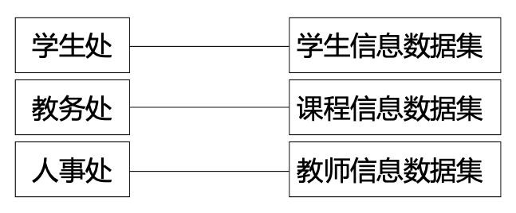 | 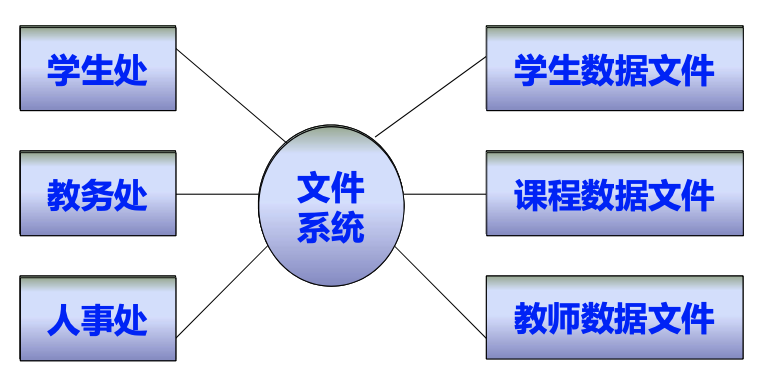 | 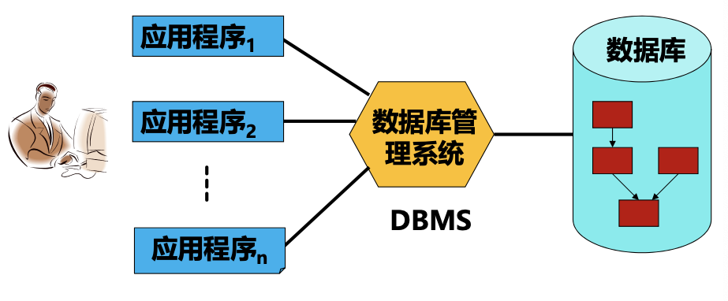 |

- 20世纪60年代末的三件大事

  - 1968年——IMS系统（层次模型）
    - IBM和Rockwell联合开发以满足阿波罗计划。
  - 1969年——DBTG报告（网状结构）
    - 美数据系统语言写会CODASYL发表的标准规范。
  - 1970年——IBM公司E.F.Codd的文章（关系模型）
    - 奠定关系数据库的理论基础。
    - 关系数据库成为主流：DB2, Oracle, SQL Server。

- 数据库系统和文件系统的根本区别

  - 在文件系统中，记录内部有了某些结构，但记录之间没有联系。数据库系统实现整体数据结构化（整体是结构化的，数据之间是具有联系的）。
  - 在文件系统中，数据的最小存取单位是记录，粒度不能细化到数据项。数据库系统中可以存取数据库中某一个数据项、一组数据项、一个记录、一组记录。

### 1.2 数据模型

- 模型是现实世界特征的模拟和抽象。
- 数据模型也是一种模型，是现实世界数据特征的抽象。
- A data model is an abstract model that organizes elements of data and standardizes how they relate to one another and to properties of the real world entites.
- 数据模型用于抽象、表示和处理现实世界中的数据和信息。
- 数据模型应满足三方面要求：
  - 能比较真实地模拟现实世界。
  - 容易为人所理解。
  - 便于在计算机上实现。
- 数据模型相关的三个世界：现实世界、信息世界、机器世界。

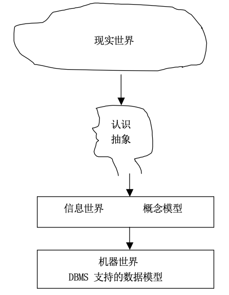

- 数据模型的设计有三个阶段：概念模型、逻辑模型、物理模型。其中概念模型和逻辑模型需要我们去设计，物理模型交由DBMS生成。

#### 1.2.1 概念模型

- 概念模型的功能
  - 在信息世界里对现实世界进行建模。
  - 表达现实世界中的概念。
  - 表达概念之间的关系。
  - 表达业务领域的语义知识。
- 概念模型的要求
  - 具有很强的表达能力。
  - 易于理解。
  - 简单。
- 概念模型的定义

为正确直观地反映客观事物及其联系，对所研究的信息世界，按用户观点对数据和信息建模，称之为概念模型（用于数据库设计）。**概念模型的建立对于理解用户需求十分重要，并且在实际工作生产中没有想象的那么容易，需要与客户进行有效的需求沟通。**

- 概念模型的特点
  - 是独立于计算机系统的模型，完全不涉及信息在系统中的表示。
  - 用于建立信息世界的数据模型，是现实世界的第一层抽象（实现到机器世界的中间层）。
  - **强调语义表达功能，概念简单、清晰，易于用户理解，是用户和DB设计人员之间交流的语言，是DB设计人员进行数据库设计的工具。**
- 概念模型的基本概念
  - 实体 (Entity)
  - 实体集 (Entity Set)
  - 实体标识符 (Key)
  - 属性 (Attribute)
  - 域 (Domain)
  - 实体型 (Entity Type)
  - 联系 (Relationship)
    - 1:1 一对一联系
    - 1:n 一对多联系
    - m:n 多对多联系

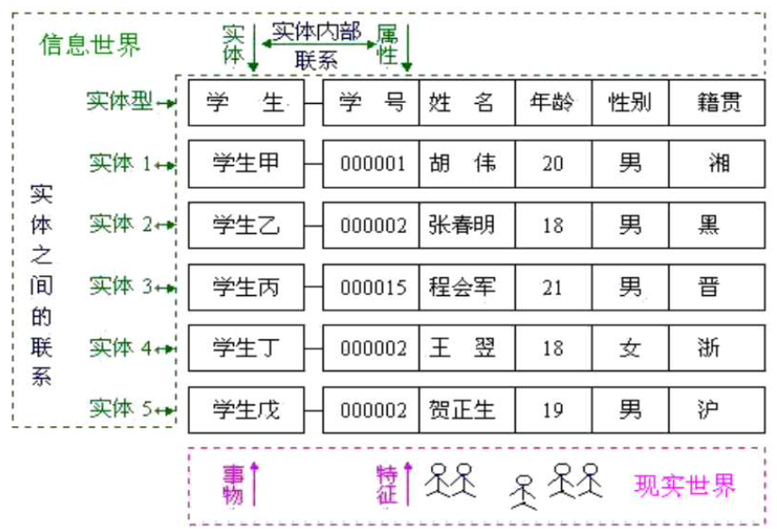

- 概念模型的表示——实体-联系模型（E-R模型）

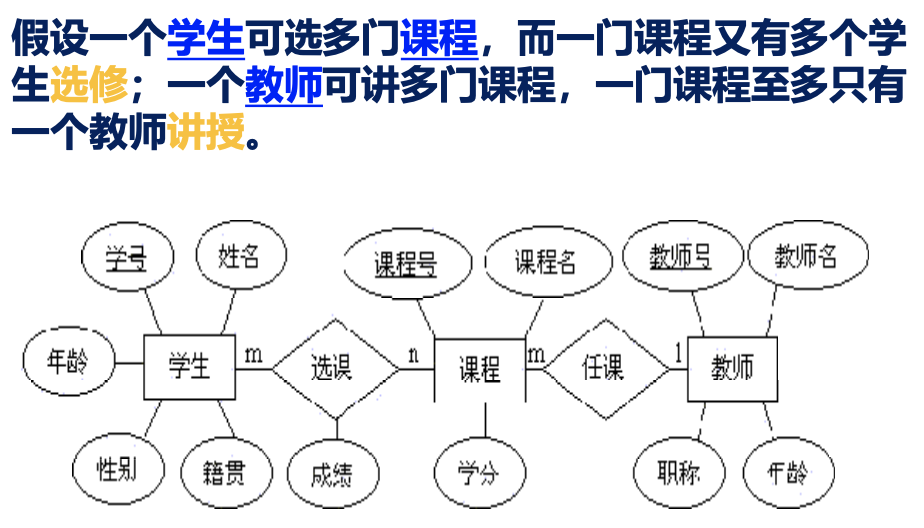

缺陷在于：E-R模型是一种静态信息模型，只能反映当前状态，不能反映实体的变化过程。

#### 1.2.2 数据模型的组成要素

1. 数据结构：是所研究对象类型的集合，即对实体类型和实体间联系的表达和实现，是系统静态特征的描述。
2. 数据操作：是指对数据库中各对象允许执行的操作的集合，包括检索和更新两类，是系统动态特征的描述。
3. 数据完整性约束：给出数据及其联系应具有的制约和依存规则，保证数据的正确、有效、相容。有实体完整性、参照完整性和用户定义的完整性。

#### 1.2.3 逻辑模型

- A logical data model or logical schema is a data model of a specific problem domain expressed independent of a particular database management product or storage technology (physical data model) but in terms of data structures such as relational tables and columns, object-oriented classes, or XML tags.

- This is as opposed to a conceptual data model, which describes the semantics of an organization without reference to technology.

- 概念模型表达语义无关实现技术；逻辑模型关系实现技术无关物理平台。

- 层次模型 (Hierarchical Model)
  - 数据结构：按照树形结构组织数据，以记录类型为结点，以结点间联系为边的有序树或森林。有且只有一个结点没有双亲结点（即根结点），根以外的其他结点有且只有一个双亲结点。适合于表示一对多关系，表示多对多关系可以用冗余结点法或虚拟结点法。
  - 数据操纵：
    - 查询
    - 插入：如果没有相应的双亲结点，不能插入子结点。
    - 删除：如果删除双亲结点，则相应的子女结点也被同时删除。
    - 更新：应修改所有相应的记录，以保证数据的一致性。
  - 存储结构：
    - 邻接法：按照层次树前序遍历邻接存放，即物理空间相连。
    - 链接法：用指引元来反映数据之间的层次联系，如孩子兄弟链接法、层次序列链接法。
  - 优缺点：
    - 优点：层次数据模型简单，对具有一对多的层次关系描述自然；直观且容易理解；记录之间联系通过指针实现，查询效率高；层次数据模型提供了良好的完整性支持。
    - 缺点：多对多联系表示存在数据冗余；结构严格复杂编程困难；对插入和删除数据操作限制多；查询子女必须通过双亲结点。
  - 典型的层次数据库系统：1986年IBM公司IMS数据库管理系统
  
- 网状结构 (Network Model)
  - 数据结构：用有向图表示实体及实体间联系，以记录类型为结点，结点间联系为边（适合多对多关系）。允许一个以上的结点无双亲结点，一个结点可以有多于一个双亲结点。1973年图灵奖获得者C.W.Bachman于1964年主持与开发了最早的网状数据库系统IDS。1972年推出的DBTG报告首次确定的数据库的**三层体系结构**，是数据库历史上的里程碑。
  - 数据操纵：
    - 查询
    - 插入：允许插入尚未确定双亲结点值的子女结点
    - 删除：允许只删除双亲结点值
    - 更新
  - 存储结构：单向链接、双向链接、环状链接、向首链接。
  - 优缺点：
    - 优点：在两个结点之间可以有两种或多种联系；记录之间的联系通过指针实现，m:n联系也容易实现，存取（查询）效率较高。
    - 缺点：结构比较复杂，而且随着应用环境的扩大，数据库的结构就变的越来越复杂，不利于用户掌握；编程复杂。
  - 典型的网状结构数据库系统：IDMS、DMS1100、IDS/2、IMAGE。
  
- 关系模型 (Relationship Model)

  - 定义：用二维表来表示实体集，用外键表示实体间的联系，这样的数据模型称为关系数据模型。
  - 一些概念：
    - 关系（Relation）：一个关系对应通常说的一张表。
    - 元组（Tuple）：表中的一行即为一个元组。
    - 属性（Attribute）：表中的一列即为一个属性。
    - 主码（Key）：表中的某个属性（组），它可以唯一确定一个元组。
    - 域（Domain）：属性的取值范围。
    - 分量：元组中的一个属性值。
    - 关系模式：对关系的描述，二维表表头一行。关系名（属性1，属性2，…，属性n）。

  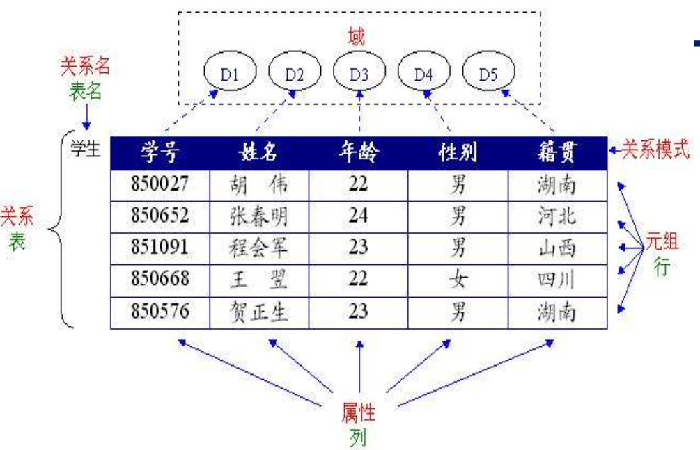

  - 数据操纵：查询、插入、删除、更新
  - 完整性约束：
    - 实体完整性
    - 参照完整性
    - 用户定义的完整性
  - 存储结构：
    - 表以文件形式存储
    - 有的DBMS一个表对应一个操作系统文件
    - 有的DBMS自己设计文件结构
  - 优缺点：
    - 优点：关系模型建立在严格的数学概念基础上。关系模型概念单一，无论实体还是实体之间的联系都用关系表示，检索结果也是关系。结构简单、清晰，用户易懂易用。关系模型的存取路径对用户透明，具有更高的数据独立性，更好的安全保密性。
    - 缺点：由于存取路径对用户透明，查询效率往往不如非关系数据模型高。
  - 典型的关系数据库管理系统
    - Oracle
    - SQL Server
    - MySQL
    - Sybase
    - Informix
    - DB/2
    - DM/2
    - OpenBase

- 三种模型的对比

| 类型         | 数据组织方法 | 特点                             |
| ------------ | ------------ | -------------------------------- |
| 层次数据模型 | 层次方法     | 适于描述层次结构的数据           |
| 网状数据模型 | 网络方法     | 速度快、不易掌握                 |
| 关系数据模型 | 关系方法     | 易于理解和使用、有严格的理论基础 |

### 1.3 数据库系统结构

#### 1.3.1数据库系统的模式结构

- 数据库系统模式的概念

  - 型（Type）：对某一类数据的结构和属性的说明。
  - 值（Value）：是型的一个具体赋值。
  - 模式（Schema）：数据库逻辑结构和特征的描述；是型的描述；反映的是数据的结构及其联系；模式是相对稳定的。
  - 实例（instance）：模式的一个具体值；反映数据库某一时刻的状态；同一个模式可以有很多实例；实例随数据库中的数据的更新而变动。
  - 数据库系统的种类很多（数据模型、数据库语言、操作系统、存储结构可以不同），但架构上有共同特征（采用三级模式结构、提供两级映像功能）。

- 数据库系统的三级模式结构

  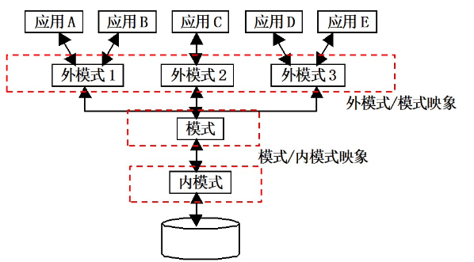

  - 外模式（External Schema）
    - 定义：最接近于用户的一级，是用户与DBS的接口，使用户看到和使用的局部数据的逻辑结构和特征的描述，又称用户视图。与某一应用有关的数据的逻辑表示。
    - 特点：用户的所有操作都是针对用户视图进行的；**一个数据库可以有多个外模式**；每个用户必须使用一个外模式，一个外模式可以有数个不同用户使用，一个应用程序只能使用一个外模式。
    - 优点：接口简单、使用方便；保证数据独立性；增强了数据的安全保密性。
  - 模式（Schema）
    - 定义：模式是数据库中全部数据的逻辑结构和特征的描述，不仅要描述概念记录类型，还要描述记录间的联系、操作、数据的完整性和安全性等。
    - 特点：介于用户级和物理级之间，是所有用户的公共数据视图（全局的数据视图），是数据库管理员看到和使用的数据库。模式不涉及到存储结构、硬件环境、访问技术等细节，也不涉及应用程序、开发工具、程序设计语言等。一个数据只存在一个DBA视图，即**一个数据库只有一个模式**。
  - 内模式（Internal Schema）
    - 定义：是数据物理结构和存储方式的描述，是数据在数据库内部的表示方式。定义了所有的内部记录类型、索引和文件的组织方式，以及数据控制方面的细节。
    - 特点：**一个数据库只有一个内模式**。

- 数据库的二级映象功能与数据独立性

  - 模式/内模式映象
    - 定义：用于定义模式和内模式之间的对应性，以及数据库全局逻辑结构与存储结构之间的对应关系。
    - 特点：数据库只有一个模式/内模式映象。在模式中描述。
  - 外模式/模式映象
    - 定义：外模式与模式之间的对应关系。
    - 特点：每一个外模式都对应一个映象。在外模式中描述。

  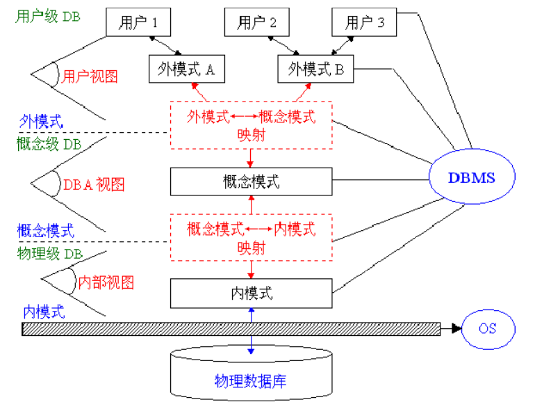

- 数据库系统的两级独立性：数据独立性指数据间相互独立、不受影响

  - 物理独立性：对内模式的修改尽量不影响模式，对外模式和应用程序的影响更小，保证数据与程序的物理独立性。（修改模式/内模式映象）
  - 逻辑独立性：对模式的修改尽量不影响外模式，从而应用程序不必修改，这样保证数据与程序的逻辑独立性。（修改外模式/模式映象）

### 1.4 数据库系统的组成

- 数据库
  - 物理数据库：应用数据的集合，是DB的主体。
  - 描述数据库：关于各级数据结构的描述。
- 硬件

包括CPU、内存、外存、I/O设备、数据通道等设备。

- 软件

DBMS、OS、各种与数据库接口的高级语言及编译系统、应用开发工具、数据库应用系统。

- 人员
  - 数据库管理员（DBA）职责是：模式定义；内模式定义；修改模式和内模式；数据库访问权限定义；完整约束性说明；监控数据库使用与运行；数据库改进与重组重构。
  - 系统分析员的职责是：应用系统的需求分析和规范说明；系统的软硬件配置确定；数据库的概要设计。
  - 数据库设计人员的职责是：数据库中数据的确定；各级模式的设计；用户需求调查和系统分析；数据库设计。
  - 应用程序员的职责是：设计与编写应用程序模块；调试和安装。
  - 用户

- Web应用架构

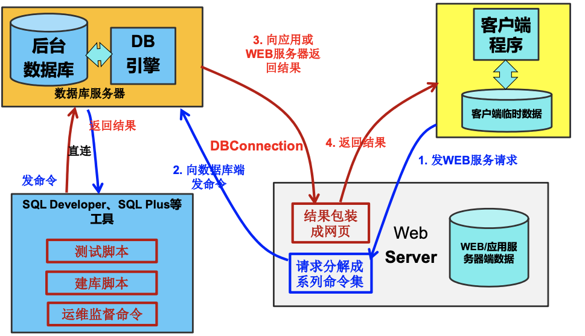

### 1.5 数据库技术的研究领域

数据库研究呈现多学科交叉和融合的发展态势，设计网络技术、多媒体、人机交互、全文检索、海量存储系统等领域。

1. 内存数据库
2. 非结构化数据管理（Video数据库）
3. XML数据管理及检索优化
4. 传感器网络数据管理
5. Web数据管理
6. 移动对象和基于位置的服务
7. 数据挖掘与知识工程
8. 众包技术

### 1.6 小结

DB；DBMS；DBS；1:1联系；1:N联系；M:N联系；数据模型；概念数据模型；逻辑数据模型；层次模型；网状模型；关系模型；模式；外模式；内模式；模式/内模式映象；外模式/模式映象；数据独立性；物理数据独立性；逻辑数据独立性
