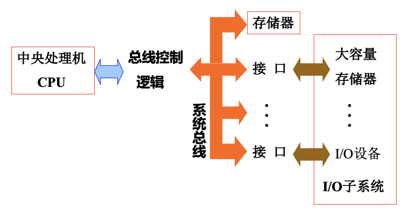
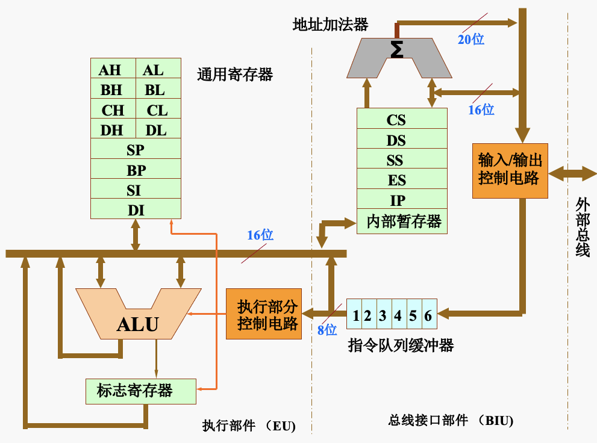
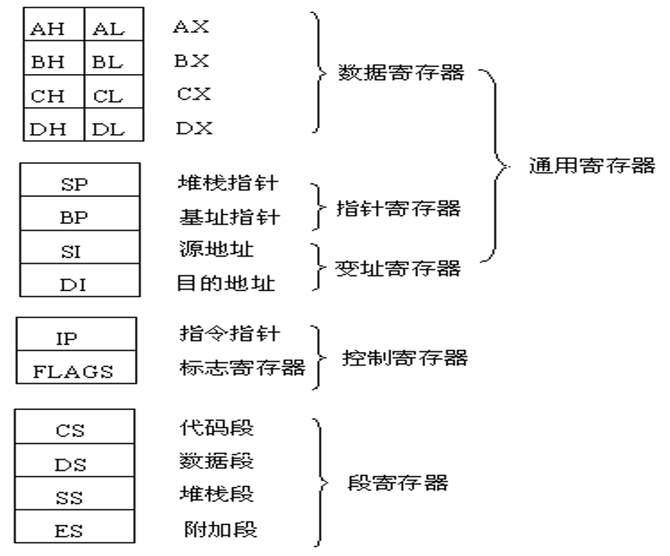
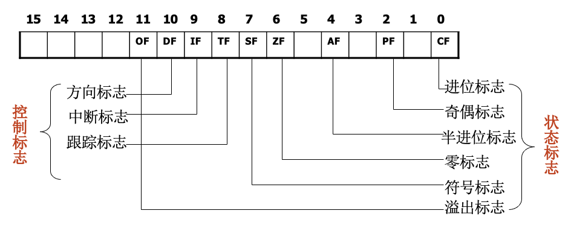
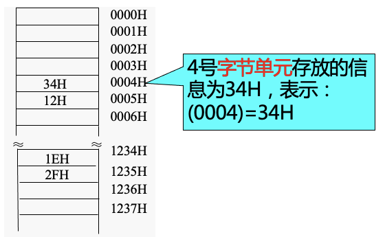
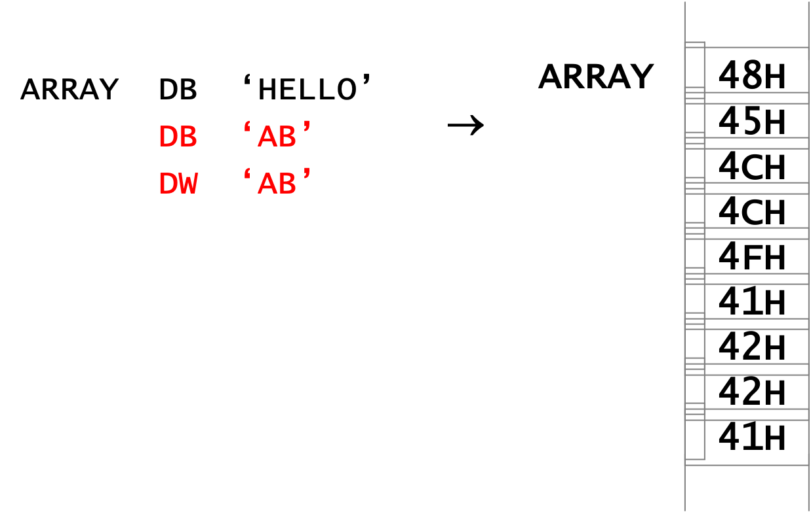
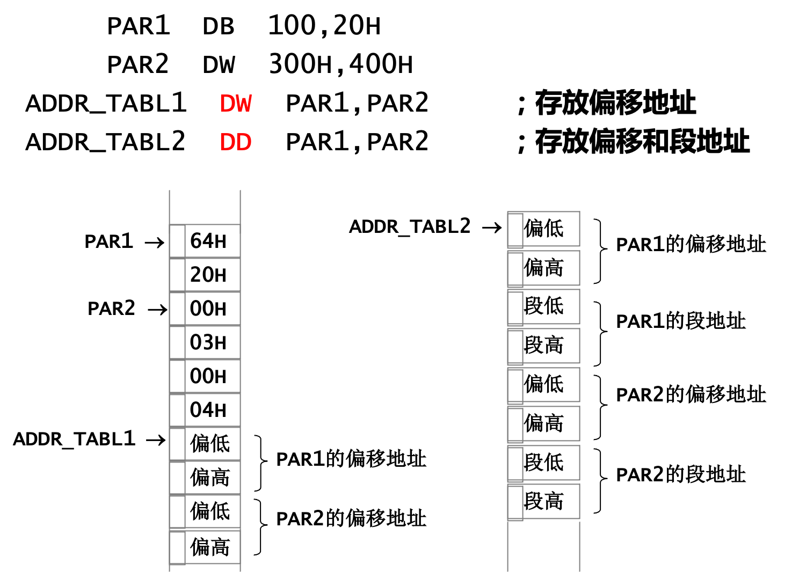
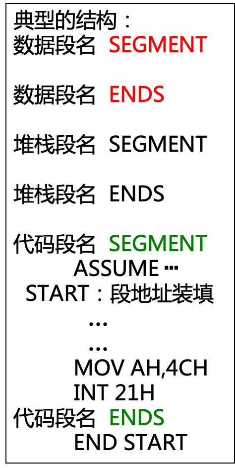
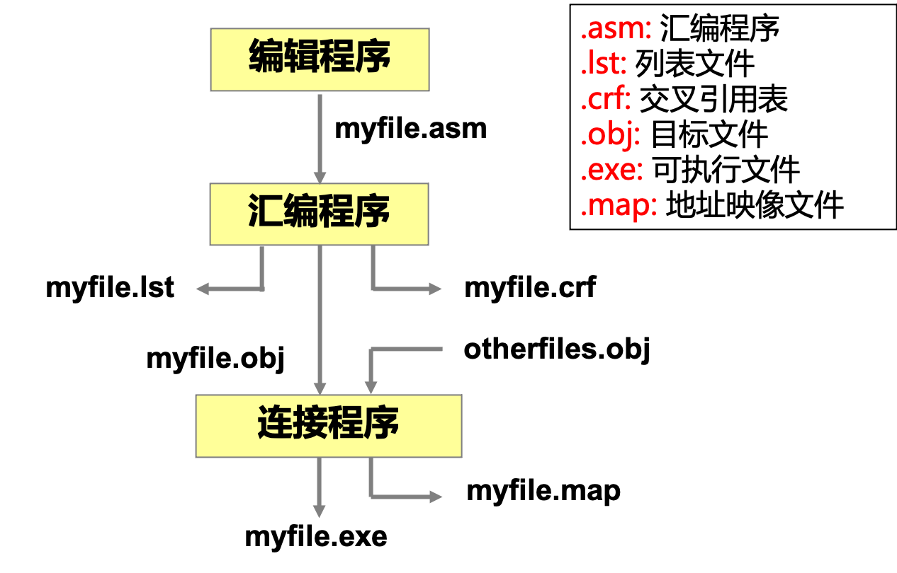

# 汇编与接口技术

*Author: ZhaoLulu@BJTU*

*Teacher: WuWeimin@BJTU*

*Date: 2021.9.6*

## 第0章 课程介绍与基础知识

#### 0.1 课程特点

具有技术性、工程性和实践性等特点，是理论联系实际，提高实际应用能力的重要教学环节，它在培养高素质人才中具有重要的地位和作用。因此学生只有通过大量的实验才能取得良好的教学效果。

#### 0.2 教学目标

- 了解计算机系统内部运行机制。
- 学会汇编语言编程的基本技术
- 掌握接口的基本工作原理。
- 掌握用汇编语言对接口进行控制的方法。

#### 0.3 课程内容

| 教学环节 | 课时分配                                 |
| -------- | ---------------------------------------- |
| 理论教学 | 48学时（汇编语言20学时，接口技术28学时） |
| 实验教学 | 8个实验（汇编语言2个，接口技术6个）      |

#### 0.4 课程考核

总成绩(100%)=期末考试(50%)+平时成绩(20%)+常规实验(15%)+研究性实验(15%)

#### 0.5 学习建议

- 认真听讲及时复习。
- 上机前认真编写程序，独立完成实验。
- 多读多写程序，多上机调试程序并注意观测接口的状态。从中体会汇编语言对接口的控制作用。

#### 0.6 联系方式

- 疑难解答wmwu@bjtu.edu.cn
- 作业提交jwc.bjtu.edu.cn

#### 0.7 计算机语言的发展

机器语言 -> 汇编语言 -> 高级语言

#### 0.8 汇编语言的特点

- 面向机器的低级语言。
- 保持机器语言的优点（直接和简洁）。
- 可有效地访问、控制计算机的各种硬件设备（如磁盘、存储器、CPU、I/O端口等）。
- 目标代码剪短，占用内存少，执行速度快。

#### 0.9 汇编语言的应用

- 系统程序
- 效率代码
- I/O驱动程序

#### 0.10 接口的功能

- 执行CPU命令的功能（在命令寄存器中称为命令口）。
- 返回外设状态的功能（在状态寄存器中称为状态口）。
- 数据缓冲能力（在数据缓冲寄存器中称为数据口）。
- 信号转换功能。
- 设备选择功能。
- 数据宽度和数据格式转换功能。

#### 0.11 接口的组成

##### （1）硬件电路

1. 接口逻辑电路（命令寄存器、状态寄存器、数据缓冲寄存器）
2. 端口地址译码电路
3. 供选电路

##### （2）软件编程

1. 初始化程序段
2. 传送方式处理程序段
3. 主控程序段
4. 程序终止与退出程序段
5. 辅助程序段

#### 0.12 CPU与接口交换数据的方式

- 查询方式

  信息交换的控制完全由主机执行程序实现，程序查询方式接口中设置一个数据缓冲寄存器（数据端口）和一个设备状态寄存器（状态顿口）。主机进行I/O操作时，先发出询问信号，读取设备的状态并根据设备状态决定下一步操作究竟是进行数据传送还是等待。

  在这种控制方式下，CPU一旦启动I/O，就必须停止现行程序的运行，并在现行程序中插入一段程序。程序查询方式的主要特点是CPU有踏步等待现象，CPU与I/O串行工作。这种方式的接口设计简单、设备量少，但CPU在信息传送过程中要花费很多时间来查询和等待，而且在一段时间内只能与一台外设交换信息，效率大大降低。

- 中断方式

  CPU在程序中安排好于某个时刻启动某台外设，然后CPU继续执行原来的程序，不需要像查询方式一样一直等待外设准备就绪。一旦外设完成数据传送的准备工作，就主动向CPU发出中断请求，请求CPU为自己服务。在可以响应中断的条件下，CPU暂时中止正在执行的程序，转去执行中断服务程序为外设服务，在终端服务程序中完成一次主机与外设之间的数据传送，传送完成后，CPU返回原来的程序。

- DMA方式

  主存和DMA接口之间有一条直接的数据通路。由于DMA方式传送数据不需要经过CPU，因此不必中断现行程序，I/O与主机并行工作，程序和传送并行工作。

#### 0.13 分析与设计接口电路的基本方法

| 方法       | 内容                                                         |
| ---------- | ------------------------------------------------------------ |
| 两侧分析法 | （1）搞清CPU一侧三总线：数据总线、地址总线的宽度及控制总线的逻辑定义和时序关系。（2）外设搞清两点：外设的信号引脚的功能定义和逻辑定义、被控外设的工作过程。 |
| 软硬结合法 | （1）硬件方面合理选用外围接口芯片，有针对性地设计附加电路。（2）采用汇编语言直接对底层硬件编程，采用DOS功能调用和BIOS调用编程。 |

## 第1章 80X86微机

### 1.1 80X86计算机组织

#### 1.1.1 计算机系统



#### 1.1.2 8086 CPU的基本性能指标

- 16位微处理器。
- 16根数据线和20根地址线（寻址空间1MB）。
- 可以和浮点运算器、I/O处理器或其他处理器组成多处理器系统，从而极大地提高系统的数据吞吐能力和数据处理能力。

#### 1.1.3 8086 CPU的结构

8086 CPU可分为指令执行部件EU和总线接口部件BIU两部分。



- 指令执行部件EU

1. 功能：控制和执行指令。
2. 组成：算术逻辑运算部件ALU、EU单元控制系统、寄存器。

- 总线接口部件BIU

1. 功能：预取指令和数据，总线操作，信息传递。
2. 组成：指令队列、指令指针寄存器、地址加法器。

#### 1.1.4 8086 CPU的寄存器结构



- 数据寄存器用来保存操作数或运算结果等。
- AX是累加器，用于算术、逻辑运算以及外设传送信息等。
- BX是基址寄存器，常用于存放存储器地址。
- CX是计数器，作为循环或串操作等指令中的隐含计数器。
- DX是数据寄存器，用来存放双字数据的高16位或存放外设端口地址。
- 指针寄存器和变址寄存器用于存放某个存储单元的偏移地址。
- SP用于存放当前堆栈中栈顶的偏移地址。
- BP用于存放堆栈段中某一存储单元的偏移地址。
- 在字符串操作中，SI和DI都具有自动增量或减量的功能。
- 指令指针寄存器保存下一次将要取出指令的偏移地址，IP的内容由微处理器硬件自动设置，有一些指令可以改变IP的值，如转移指令、子程序调用指令等。
- 标志寄存器包含9个标志位，保存一条指令执行后，CPU所处状态信息及运算结果的特征。
- 4个16位的段寄存器分别为CS（Code代码段）、DS（Data数据段）、SS（Stack堆栈段）、ES（Extra额外段）。

#### 1.1.5 通用寄存器的专门用途

| 寄存器 | 用法                                        |
| ------ | ------------------------------------------- |
| AX     | 字乘法，字除法，字I/O                       |
| AL     | 字节乘法，字节除法，字节I/O，十进制算术运算 |
| AH     | 字节乘法，字节除法，DOS中断功能号           |
| BX     | 存储器指针                                  |
| CX     | 串操作或循环控制计数器                      |
| CL     | 移位计数器                                  |
| DX     | 字乘法，字除法，间接I/O                     |
| SI     | 存储器指针（串操作中的源指针 ）             |
| DI     | 存储器指针（串操作中的目的指针）            |
| BP     | 存储器指针（存储堆栈指针）                  |
| SP     | 堆栈指针                                    |

#### 1.1.6 寄存器与存储器的比较

- 寄存器

1. 在CPU内部。
2. 访问速度快。
3. 容量小，成本高。
4. 用名字表示，没有地址。

- 存储器

1. 在CPU外部。
2. 访问速度慢。
3. 容量大，成本低。
4. 用地址表示。

#### 1.1.7 标志寄存器的格式与含义



#### 1.1.8 8086实模式

存储器的组织采用分段方式，20位的物理地址由16位的段地址和16位的偏移地址形成，每个段的最大寻址空间为64KB。

#### 1.1.9 存储器

- 存储单元的地址：将存储单元编号，该编号就是存储器地址（地址使用十六进制表示） 。
- 存储单元的内容：存储单元中存放的信息就是存储单元的内容。
  - 表示：（存储地址），如(X)、(Y) = ((X))。
  - 在8086 中字节8位，字16位，双字32位。
  - 存储字时采用小端序，即低位字节放低地址单元，高位字节放高地址单元。



- 段地址：表示一个段的开始（5位十六进制数的前4位，最后一位为0）。
- 偏移地址：在段内相对于段起始地址的偏移值。
- 物理地址 = 段地址 左移4位 + 偏移地址
- 优点：有利于程序在存储器中的重定位；有利用程序和数据分离。
- 实模式下8086段寄存器如下分配：

| 寄存器 | 内容         |
| ------ | ------------ |
| CS     | 代码段段地址 |
| DS     | 数据段段地址 |
| SS     | 堆栈段段地址 |
| ES     | 附加段段地址 |

- 段寄存器与偏移寄存器的组合规则如下：

| 段寄存器 | 偏移寄存器         | 主要用途   |
| -------- | ------------------ | ---------- |
| CS       | IP                 | 指令寻址   |
| SS       | SP或BP             | 堆栈寻址   |
| DS       | BX、DI、SI、16位数 | 数据寻址   |
| ES       | 串指令DI           | 目标串寻址 |

### 1.2 寻址方式

#### 1.2.1 寻址的分类

8086中寻址分为操作数寻址和指令寻址：

- 操作数寻址：与数据有关的寻址方式。
- 指令寻址：与转移地址有关的寻址方式。

指令寻址又可以分为：顺序寻址和跳转寻址。

#### 1.2.2 8086的指令格式

格式：**MOV DST SRC**

功能：源操作数SRC的内容传送到目标操作数DST，源操作数中的内容不变。

#### 1.2.3 操作数寻址方式简介

- 立即寻址方式
  - 指令格式：MOV AX, 3064H
  - 特点：操作数在代码段中。
  - 注意：
    - 只能用于SRC字段。
    - SRC和DST字长要一致。
- 寄存器寻址方式
  - 指令格式：MOV AX, BX
  - 特点：操作数在寄存器中，不需要访问存储器，速度快。
  - 注意：
    - SRC和DST字长要一致。
    - CS不能用MOV指令改变。
- 直接寻址方式
  - 指令格式：MOV AX, [2000H]
  - 特点：隐含的段为数据段DS，也可以使用段跨越前缀（MOV AX, ES: [2000H]）。
- 寄存器间接寻址
  - 指令格式：MOV AX, [BX]
  - 特点：BX、SI、DI默认段是DS，BP默认段是SS。
  - 注意：
    - 不允许使用AX、CX、DX存放EA。
    - SRC和DST字长要一致。
  - 适用：数组、字符串、表格的处理。
- 寄存器相对寻址方式
  - 指令格式：MOV AX, COUNT[SI]
  - 适用：数组、字符串、表格的处理。
- 基址变址寻址
  - 指令格式：MOV AX, [BX] [DI]
  - 注意：必须是一个基址寄存器和一个变址寄存器的组合。
  - 8086中基址寄存器有BX（操作数在数据段）和BP（操作数在堆栈段），变址寄存器有SI和DI。
  - 适用：数组、字符串、表格的处理。
- 相对基址变址寻址方式
  - 指令格式：MOV AX, MASK [BX] [SI]
  - 有效地址：PA = (BX) + (SI) + MASK

#### 1.2.4 指令寻址方式简介

- 段内直接寻址
  - 转移的有效地址 = 当前(IP) + 位移量(8 bit/16bit)
    - JMP NEAR PTR NEXT 近转移 -32768~+32767
    - JMP SHORT NEXT 短转移 -128~+127

- 段内间接寻址
  - 转移的有效地址是一个寄存器或内存单元的内容。

### 1.3 伪指令和程序格式

#### 1.3.1 伪操作（伪指令）

- 定义：伪操作是汇编程序对源程序进行汇编时处理的操作，完成处理器的选择、存储模式的定义、数据的定义、存储器的分配、指示程序开始与结束等。
- 功能：
  - 处理器选择伪操作
  - 段定义伪操作
  - 程序开始和结束伪操作
  - 数据定义及存储器分配伪操作
  - 表达式赋值伪操作
  - 地址计数器与对准伪操作
  - 基数控制伪操作

#### 1.3.2 语句类型和格式

- 语句类型：
  - 指令性语句：完成一定的操作功能，能够翻译成机器代码的语句。
  - 指示性语句：为汇编程序在翻译汇编语言源程序时提供有关信息，并不翻译成机器代码。
- 段定义伪操作

段名 SEGMENT [定位类型] [组合类型] [使用类型] [类别]

段名 ENDS

| 参数                 | 内容                              |
| -------------------- | --------------------------------- |
| 定位类型align_type   | PARA, BYTE, WORD, DWORD, PAGE     |
| 组合类型combine_type | PRIVATE, PUBLIC, COMMON, STACK AT |
| 使用类型use_type     | USE16, USE32                      |
| 类别class            | class                             |

- 指定段址伪操作：建立段寄存器与段的缺省关系

ASSUME <段寄存器>:<段名>[,<段寄存器>:<段名>...]

如：assume cs:code, ds:data, es:extra

- 设置段地址值：在程序的代码段开始处进行DS、SS、ES的段基址装填。

如：MOV AX,DATA和MOV DS,AX完成DS的装填。

- 结束伪操作：END [label]
- 数据定义及存储器分配伪操作：[变量] 助记符 操作数 [,操作数,...] [;注释]

助记符有：DB（定义字节）DW（定义字）DD（定义双字）DF DQ（64位）DT（80位）

几个例子：






- 表达式赋值伪操作：表达式名 EQU 表达式

EQU和=的区别：同一个程序中=可以对一个符号重复定义，EQU不能对一个符号重复定义。

比如：Y1 = 7; Y1 = 128 可以

Y1 EQU 7; Y1 EQU 128 不可以

但是可以用Y1 EQU 7; PURGE Y1; Y1 EQU 128

- 地址计数器$与对准伪操作

地址计数器$保存当前正在汇编的指令的地址。

比如：ORG $+8 ;跳过8个字节的存储区

JNE $+6 ;转向地址是JNE地址的+6

JMP $+2 ;转向下一条指令


常用来确定数组中元素的个数。

比如：BUF1 DB 1,2,3,4,5

CNT1 EQU $-BUF1

BUF2 DW 1,2,3,4,5

CNT2 EQU ($-BUF2)/2

- ORG伪操作
- 表达式操作符
  - 算术操作符：$+ - \times / \, mod$
  - 逻辑和移位操作符：AND、OR、XOR、NOT、SHL、SHR
  - 关系操作符：EQ、NE、LT、LE、GT、GE 真值为FFFFH假值为0000H
  - 数值回送操作符：OFFSET、SEG、LENGTH、SIZE
  - 属性操作符：PTR暂时改变变量或标号的原有属性

#### 1.3.3 语汇编语言程序结构

- 典型结构



- 例子：求字存储单元中两个数之差，结果存入下一个相邻的字单元中。

```
DATA   SEGMENT
BUF    DW 3483H,4596H
RES    DW  ? 	
DATA   ENDS
STACK  SEGMENT STACK ‘STACK’
       STA  DW 100 DUP(?)
STACK  ENDS
CODE   SEGMENT
       ASSUME CS:CODE.DS:DATA
START: MOV AX,DATA              
       MOV DS,AX 
       MOV AX,BUF
       SUB AX,BUF+2
       MOV RES,AX 
       MOV AH,4CH
       INT  21H                                 
CODE   ENDS
END    START
```

- 汇编程序运行步骤与生成的文件



### 1.4 8086的指令系统

