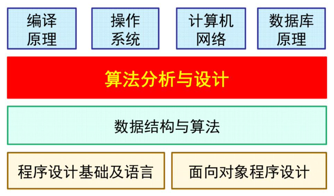

# 算法分析与设计

*Author: ZhaoLulu@BJTU*

*Teacher: LiQiang@BJTU*

*Date: 2021.9.7*

### 第0章 导论

#### 0.1 课程介绍

- 本课程与其他课程的关系



是程序设计语言与基础、面向对象程序设计、数据结构的后续课程，编译原理、操作系统、计算机网、数据库原理的先修课程，难度较大。

- 课程内容与考试安排

| 课程内容             |
| -------------------- |
| Chap1 绪论           |
| Chap2 算法复杂度     |
| Chap3 递归、回溯算法 |
| Chap4 分治算法       |
| Chap5 图论基础       |
| Chap6 动态规划       |
| Chap7 贪心算法       |
| Chap8 搜索           |

考试形式：开卷

分数构成：出勤（10分）课堂作业（30分）期末考试（60分）

- 课程准备
  - 程序设计语言
  - 数据结构
  - 计算机数学
- 学习资源与参考书籍
  - Cracking the Coding Interview: 150 Programming Questions and Solutions (answers: http://hawstein.com/posts/ctci-solutions-contents.html)
  - algo.bjtu.edu.cn
  - www.leetcode.com
  - 《剑指Offer》《编程之美》
  - 《算法设计与问题求解》李清勇
  - 《算法导论》Thomas H.Cormen
  - 《Algorithms》Dasgupta/Papadimitriou/Vazirani
  - 《Algorithm》Jeff Erickson

#### 0.2 算法概论

- 算法的定义：算法是指解决方案的准确而完整的描述，是一系列解决问题的清晰指令，算法代表着用系统的方法描述解决问题的策略机制。
- 为什么要学习算法？

| 算法是软件的灵魂，是计算机科学各个领域的核心。 |
| ---------------------------------------------- |
| 互联网：网页搜索、网络路由、BitTorrent         |
| 生物信息：人类基因组计划、蛋白质结构分析       |
| 计算机图形：电影、游戏、虚拟现实               |
| 计算机安全：手机、电子商务、投票系统           |
| 多媒体：MP3、JPG、HDTV                         |
| 人工智能：人脸识别、AlphaGo、聊天机器人        |
| 社会网络：推荐系统、新闻推送、广告             |
| 物理学：粒子对撞机、反物质暗物质探测           |

- 算法分析的四部分
  - What 确定需要解决的问题
  - How 算法的准确描述
  - How fast 算法复杂度
  - Why 证明算法的复杂度

#### 0.3 选择排序

- 排序的定义：

***Input:*** sequence $<a_1, a_2, \dots, a_n>$ of numbers.

***Output:*** permutation $<a_1^,, a_2^,, \dots, a_n^,>$ such that $a_1^, \le a_2^, \le \dots \le a_n^,$.

- 基于比较的排序算法的要求
  - 对称性 $a \le b, b \le a, \quad then \quad a = b$
  - 传递性 $a \le b, b \le c, \quad then \quad a \le c$
  - 整体性 $a < b | a = b | a > b$

比较 $(N - 1) + (N - 2) + \dots + 1 + 0 $ ~ $\dfrac{N^2}{2}$

交换 $N$

#### 0.4 插入排序

- Worst case: $T(n) = \sum_{j = 2}^{n}O(j) = O(n^2)$
- Average case: $T(n) = \sum_{j = 2}^{n}O(\dfrac{j}{2}) = O(n^2)$
- Best case: $N-1$次比较，$0$次交换

#### 0.5 Shell排序

- 非常实用，除了$N$非常大的情况都非常快（LQ如是说）

- （R, bzip2, linux/kernel/groups.c）

- 简单且不占内存
- 减少不必要的data movement

| algorithm         | best    | average | worst             |
| ----------------- | ------- | ------- | ----------------- |
| selection sort    | $N^2$   | $N^2$   | $N^2$             |
| insertion sort    | $N$     | $N^2$   | $N^2$             |
| shell sort (3x+1) | $NlogN$ | $?$     | $N^{\frac{3}{2}}$ |
| Goal              | $N$     | $NlogN$ | $NlogN$           |


```c++
#include <iostream>
using namespace std;

/*
 * 直接插入排序
 */
void InsertSort(int *a, int n) {
    for (int i = 1; i < n; ++i) {
        if (a[i] < a[i - 1]) {
            int j = i - 1;
            int x = a[i];
            while (j > -1 && x < a[j]) {
                a[j + 1] = a[j];
                j--;
            }
            a[j + 1] = x;
        }
    }
}

/*
 * 折半插入排序
 */
void BInsertSort(int *a, int n) {
    for (int i = 1; i < n; ++i) {
        int low = 0;
        int high = i - 1;
        int temp = a[i];
        while (low <= high) {
            int mid = (low + high) / 2;
            if (a[mid] > temp) {
                high = mid - 1;
            } else {
                low = mid + 1;
            }
        }
        for (int j = i; j > low; --j) {
            a[j] = a[j - 1];
        }
        a[low] = temp;
    }
}

/*
 * 希尔排序
 */
typedef struct {
    int key;
} SqNode;
typedef struct {
    SqNode r[15];
    int length;
} SqList;

void ShellInsert(SqList *L, int dk) {
    for (int i = 1 + dk; i <= L->length; ++i) {
        if (L->r[i].key < L->r[i - dk].key) {
            int j;
            L->r[0] = L->r[i];
            for (j = i - dk; j > 0 && (L->r[0].key < L->r[j].key); j -= dk) {
                L->r[j + dk] = L->r[j];
            }
            L->r[j + dk] = L->r[0];
        }
    }
}

void ShellSort(SqList *L, int *delta, int t) {
    for (int i = 0; i < t; ++i) {
        ShellInsert(L, delta[i]);
    }
}

/*
 * 冒泡排序（改进）
 */
void BubbleSort(int *a, int n) {
    int i = n;
    bool flag = true;
    while (i > 0 && flag) {
        flag = false;
        for (int j = 1; j < i; ++j) {
            if (a[j - 1] > a[j]) {
                swap(a[j - 1], a[j]);
                flag = true;
            }
        }
        i--;
    }
}

void swap(int *a, int *b) {
    int temp = *a;
    *a = *b;
    *b = temp;
}

/*
 * 快速排序
 */
void swap(SqNode *a, SqNode *b) {
    int key = a->key;
    a->key = b->key;
    b->key = key;
}

int Partition(SqList *L, int low, int high) {
    int pivotKey = L->r[low].key;
    while (low < high) {
        while (low < high && L->r[high].key >= pivotKey) {
            high--;
        }
        swap(&(L->r[low]), &(L->r[high]));
        while (low < high && L->r[low].key <= pivotKey) {
            low++;
        }
        swap(&(L->r[low]), &(L->r[high]));
    }
    return low;
}

void QSort(SqList *L, int low, int high) {
    if (low < high) {
        int pivotLoc = Partition(L, low, high);
        QSort(L, low, pivotLoc - 1);
        QSort(L, pivotLoc + 1, high);
    }
}

/*
 * 简单选择排序
 */
int SelectMinKey(SqList *L, int i) {
    int min = i;
    while (i + 1 <= L->length) {
        if (L->r[min].key > L->r[i + 1].key) {
            min = i + 1;
        }
        i++;
    }
    return min;
}

void SelectSort(SqList *L) {
    for (int i = 1; i <= L->length; ++i) {
        int j = SelectMinKey(L, i);
        if (i != j) {
            swap(&(L->r[i]), &(L->r[j]));
        }
    }
}

/*
 * 归并排序
 */
void Merge(SqNode *SR, SqNode *TR, int i, int m, int n) {
    int j, k;
    for (j = m + 1, k = i; i <= m && j <= n; k++) {
        if (SR[i].key < SR[j].key) {
            TR[k] = SR[i++];
        } else {
            TR[k] = SR[j++];
        }
    }
    while (i <= m) {
        TR[k++] = SR[i++];
    }
    while (j <= n) {
        TR[k++] = SR[j++];
    }
}

void MergeSort(SqNode *SR, SqNode *TR1, int s, int t) {
    SqNode TR2[15];
    if (s == t) {
        TR1[s] = SR[s];
    } else {
        int m = (s + t) / 2;
        MergeSort(SR, TR2, s, m);
        MergeSort(SR, TR2, m + 1, t);
        Merge(TR2, TR1, s, m, t);
    }
}

/*
 * 堆排序
 */
void HeapAdjust(SqList *H, int s, int m) {
    SqNode rc = H->r[s];
    for (int j = 2 * s; j <= m; j *= 2) {
        if (j + 1 < m && (H->r[j].key < H->r[j + 1].key)) {
            j++;
        }
        if (rc.key >= H->r[j].key) {
            break;
        }
        H->r[s] = H->r[j];
        s = j;
    }
    H->r[s] = rc;
}

void HeapSort(SqList *H) {
    for (int i = H->length / 2; i > 0; i--) {
        HeapAdjust(H, i, H->length);
    }
    for (int i = H->length; i > 1; i--) {
        swap(&(H->r[1]), &(H->r[i]));
        HeapAdjust(H, 1, i - 1);
    }
}

int main() {
    cout << "------直接插入排序------" << endl;
    int a[8] = {3, 1, 7, 5, 2, 4, 8, 6};
    cout << "排序前：";
    for (int i : a) {
        cout << i;
    }
    cout << endl;
    InsertSort(a, 8);
    cout << "排序后：";
    for (int i : a) {
        cout << i;
    }
    cout << endl;
    cout << "------折半插入排序------" << endl;
    int b[8] = {3, 1, 7, 5, 2, 4, 8, 6};
    cout << "排序前：";
    for (int i : b) {
        cout << i;
    }
    cout << endl;
    BInsertSort(b, 8);
    cout << "排序后：";
    for (int i : b) {
        cout << i;
    }
    cout << endl;

    cout << "------希尔排序------" << endl;
    int delta[3] = {5, 3, 1};
    auto *L1 = (SqList *) malloc(sizeof(SqList));
    L1->r[1].key = 3;
    L1->r[2].key = 1;
    L1->r[3].key = 7;
    L1->r[4].key = 5;
    L1->r[5].key = 2;
    L1->r[6].key = 4;
    L1->r[7].key = 8;
    L1->r[8].key = 6;
    L1->length = 8;
    cout << "排序前：";
    for (int i = 1; i <= 8; ++i) {
        cout << L1->r[i].key;
    }
    cout << endl;
    ShellSort(L1, delta, 3);
    cout << "排序后：";
    for (int i = 1; i <= 8; ++i) {
        cout << L1->r[i].key;
    }
    cout << endl;

    cout << "------冒泡排序（改进）------" << endl;
    int c[8] = {3, 1, 7, 5, 2, 4, 8, 6};
    cout << "排序前：";
    for (int i : c) {
        cout << i;
    }
    cout << endl;
    BubbleSort(c, 8);
    cout << "排序后：";
    for (int i : c) {
        cout << i;
    }
    cout << endl;

    cout << "------快速排序------" << endl;
    auto *L2 = (SqList *) malloc(sizeof(SqList));
    L2->r[1].key = 3;
    L2->r[2].key = 1;
    L2->r[3].key = 7;
    L2->r[4].key = 5;
    L2->r[5].key = 2;
    L2->r[6].key = 4;
    L2->r[7].key = 8;
    L2->r[8].key = 6;
    L2->length = 8;
    cout << "排序前：";
    for (int i = 1; i <= 8; ++i) {
        cout << L2->r[i].key;
    }
    cout << endl;
    QSort(L2, 1, L2->length);
    cout << "排序后：";
    for (int i = 1; i <= 8; ++i) {
        cout << L2->r[i].key;
    }
    cout << endl;

    cout << "------简单选择排序------" << endl;
    auto *L3 = (SqList *) malloc(sizeof(SqList));
    L3->r[1].key = 3;
    L3->r[2].key = 1;
    L3->r[3].key = 7;
    L3->r[4].key = 5;
    L3->r[5].key = 2;
    L3->r[6].key = 4;
    L3->r[7].key = 8;
    L3->r[8].key = 6;
    L3->length = 8;
    cout << "排序前：";
    for (int i = 1; i <= 8; ++i) {
        cout << L3->r[i].key;
    }
    cout << endl;
    SelectSort(L3);
    cout << "排序后：";
    for (int i = 1; i <= 8; ++i) {
        cout << L3->r[i].key;
    }
    cout << endl;

    cout << "------归并排序------" << endl;
    auto *L4 = (SqList *) malloc(sizeof(SqList));
    L4->r[1].key = 3;
    L4->r[2].key = 1;
    L4->r[3].key = 7;
    L4->r[4].key = 5;
    L4->r[5].key = 2;
    L4->r[6].key = 4;
    L4->r[7].key = 8;
    L4->r[8].key = 6;
    L4->length = 8;
    cout << "排序前：";
    for (int i = 1; i <= 8; ++i) {
        cout << L4->r[i].key;
    }
    cout << endl;
    MergeSort(L4->r, L4->r, 1, L4->length);
    cout << "排序后：";
    for (int i = 1; i <= 8; ++i) {
        cout << L4->r[i].key;
    }
    cout << endl;

    cout << "------堆排序------" << endl;
    auto *L5 = (SqList *) malloc(sizeof(SqList));
    L5->r[1].key = 3;
    L5->r[2].key = 1;
    L5->r[3].key = 7;
    L5->r[4].key = 5;
    L5->r[5].key = 2;
    L5->r[6].key = 4;
    L5->r[7].key = 8;
    L5->r[8].key = 6;
    L5->length = 8;
    cout << "排序前：";
    for (int i = 1; i <= 8; ++i) {
        cout << L5->r[i].key;
    }
    cout << endl;
    HeapSort(L5);
    cout << "排序后：";
    for (int i = 1; i <= 8; ++i) {
        cout << L5->r[i].key;
    }
    cout << endl;

    return 0;
}
```

