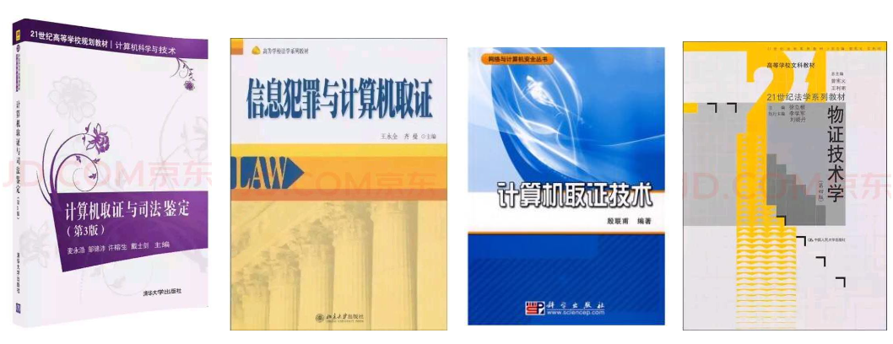
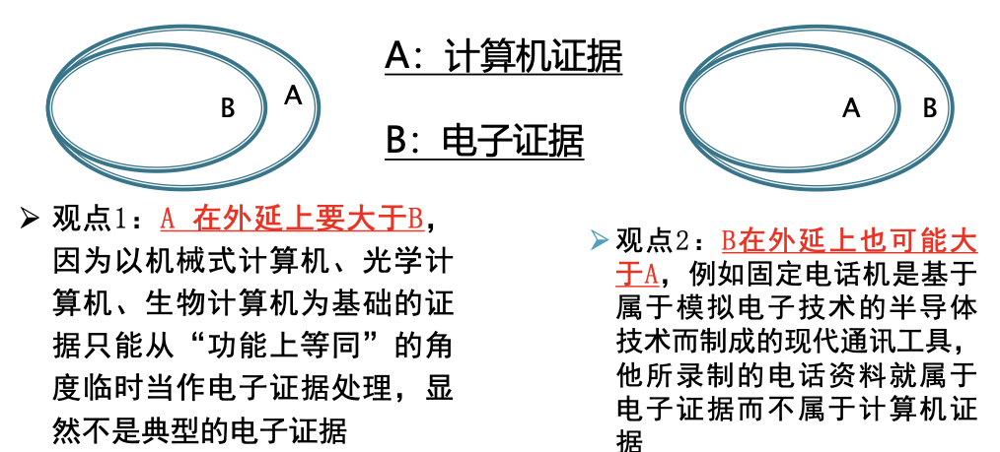

# 计算机取证

*Author: ZhaoLulu@BJTU*

*Teacher: DuanLi@BJTU*

*Date: 2021.9.9*

## 第0章 课程介绍

### 0.1 课程目标

- 介绍计算机取证的法律法规理念和证据特性。
- 介绍计算机取证技术的基本技能和技巧，使用常用的计算机取证硬件工具和软件工具,对可疑计算机中的数据进行备份和恢复，对证据综合分析并准确记录归档，最终得到有效的证据。
- 通过完成课程项目，对计算机取证案例的具体分析有基本了解和掌握。

### 0.2 教学内容

- 计算机取证概论
- 计算机取证的法学问题
- 计算机取证技术概述
- 计算机取证原理
- Windows/Linux系统取证
- 网络环境下的计算机取证
- 手机取证
- 取证案例分析

### 0.3 课程考核

- 总评成绩 = 平时成绩30分（出勤、作业、实验） + 期末成绩70分（开卷考试50分、案例项目20分）
- 考试时间：第16周随堂考试
- 教学邮箱：cv_bjtu2013@163.com bjtuaq2011

### 0.4 参考数据

- 《计算机取证与司法鉴定（第三版）》
- 《信息犯罪与计算机取证》
- 《计算机取证技术》
- 《物证技术学》

### 0.5 资源网站

- Scientific Working Group on Digital Evidence (SWGDE) http://www.swgde.org/
- American Society of Crime Laboratory Directors (ASCLD) http://www.ascld.org/
- Regional Computer Forensics Laboratory http://www.rcfl.gov/
- Digital Forensic Research Workshop，DFRWS http://dfrws.org/

## 第1章 计算机取证概述

### 1.1 背景

- 计算机 与网络称为社会经济生活的重要组成部分。
- 网络犯罪案件量及占比均呈逐年上升趋势。
- 通常计算机中会留下大量与犯罪有关的数据，进而可以依据有关科学与技术的原理和方法找到证明某个事实的证据。
- 计算机和法学的交叉学科——计算机取证受到关注。

### 1.2 计算机取证的定义

计算机取证是运用计算机及其相关科学和技术的原理与方法获取与计算机相关的证据以证明某个客观事实的过程，它包括对计算机证据的确定、收集、保护、分析、归档及法庭出示。

#### 1.2.1计算机取证、数据取证、电子取证的区别

| 取证类型                        | 主体对象                                                     |
| ------------------------------- | ------------------------------------------------------------ |
| 计算机取证 (Computer Forensics) | 是计算机系统内与犯罪案例有关的数据信息。                     |
| 数字取证 (Digital Forensics)    | 存在于各种电子设备和网络中的数字化的与犯罪案例有关的数据信息。 |
| 电子取证 (Electronic Forensics) | 存储的电子化的、能反映有关案件真实情况的数据信息。           |

#### 1.2.2 计算机证据与电子证据

- 计算机证据：是指以计算机形式存在的、用作证据使用的一切材料及其派生物，或者说借助计算机生成的一切证据。
- 电子证据：存储电子化的材料与证据。

- 两者的关系：本课程不加以区分。

#### 1.2.3 证据的性质

- 传统证据的性质：
  - 真实性：证据原件
  - 合法性：取证合规
  - 关联性：逻辑合理
- 计算机证据的性质：
  - 可信的
  - 准确的
  - 完整的
  - 合法的
- 计算机证据的新特性：多样性、电子性、准确性、脆弱性、挥发性。
- 计算机证据与传统证据的区别：计算机数据时刻在改变，必须借助适当的工具。手机过程中可能会破坏原始数据，取证步骤和程序要不断调整。而计算机证据具有优点：可以被精确复制，容易鉴别证据原件和当前电子证据之间是否有变化或关联，完全销毁比较困难。

### 1.3 计算机犯罪与泄密查处

#### 1.3.1 计算机犯罪的定义

- 我国刑法学者认为：“凡是故意或过失不当使用计算机致使他人受损失或有损失危险的行为，都是计算机犯罪。”
- 欧洲经济合作与发展组织的专家认为：“在自动数据处理过程中任何非法的、违反职业道德的、未经过批准的行为都是计算机犯罪。”
- 我国学者认为：“计算机犯罪是以计算机为工具或以计算机资产为对象的犯罪行为。”

#### 1.3.2 计算机犯罪的特点

- 犯罪形式的隐蔽性
- 复杂性（主体与客体）
- 犯罪主体和手段的智能性
- 跨国性
- 匿名性
- 社会危害性巨大
- 内部人员多和低龄化
- 持获利和探秘动机居多
- 速度快，涉及面广

#### 1.3.3 计算机犯罪的罪名

1. 非法侵入计算机信息系统罪
2. 破坏计算机信息系统罪
3. 利用计算机实施金融诈骗、盗窃、贪污、挪用公款、窃取国家秘密罪

#### 1.3.4 计算机犯罪形式

- 数据欺骗
- 意大利香肠术
- 特洛伊木马
- 冒名顶替
- 逻辑炸弹

#### 1.3.5 秘密的定义与分类

- 秘密是指关系管理人切身利益，并为权利人采取措施保护起来，使之不为不应知悉的人所知悉的事项或信息。
- 国家秘密、工作秘密、商业秘密、个人隐私。

#### 1.3.6 泄密与泄密取证

- 泄密是指应该保守的秘密超出应该被知悉的范围。
- 泄密取证是指针对泄密事件及违反保密法律法规行为的相关事实进行核查和取证的过程，是保密违法案件查处工作的重要组成部分。
- 泄密取证的目标是依法查清泄密事件及违反保密法律法规行为的相关事实。
- 泄密取证的原则包括：
  - 依法取证原则
  - 无损取证原则
  - 及时取证原则
  - 全面取证原则
  - 保密取证原则
