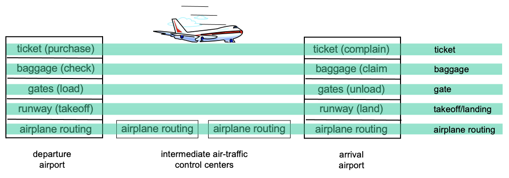
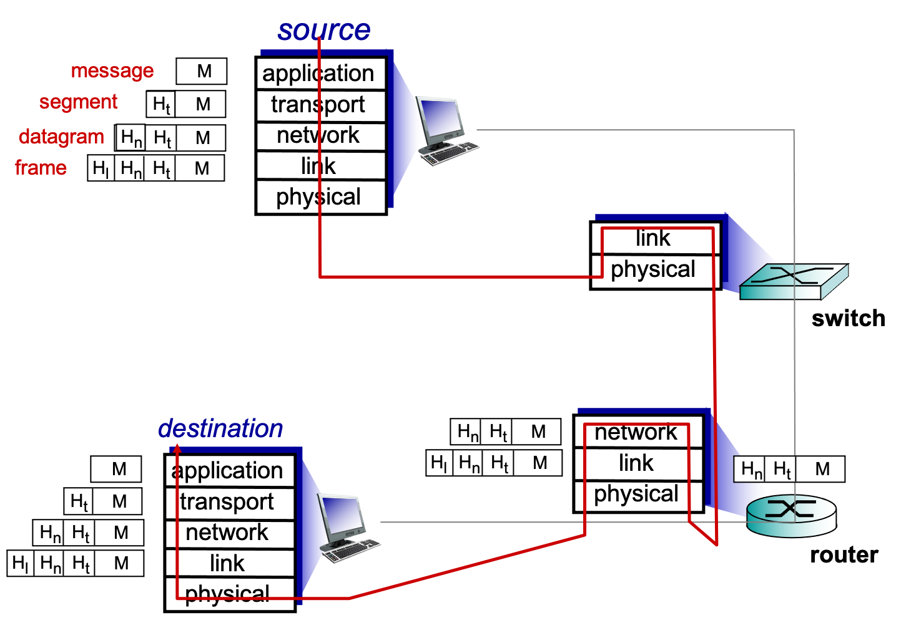

# 计算机网络原理

*Author: ZhaoLulu@BJTU*

*Teacher: WangJian@BJTU*

*Date: 2021.9.6*

## 第0章 课程介绍

### 0.1 基本信息

- 教学日历、教学大纲在课程平台上。
- 成绩由课堂考勤、作业、讨论、实验（两次前沿讲座W10、W16均须参加并提交一篇论文）。

### 0.2 课程内容

| 自上而下的课程内容设计                       |
| -------------------------------------------- |
| 引言Introduction                             |
| 应用层Application Layer                      |
| 传输层Transport Layer                        |
| 网络层Network Layer                          |
| 数据链路层Link Layer and Local Area Networks |
| 网络安全Security in Computer Networks        |

### 0.3 网络的基本功能

1. 网络提供的最基本服务：信息传递
2. 不同的网络如何区分：所提供的服务
3. 服务如何区分：
   - 功能、延迟、带宽、丢失率
   - 端节点数目、服务接口
   - 可靠性、实时/非实时等外特性

### 0.4 互联网成为网络空间的核心

| 技术         | 领域                               |
| ------------ | ---------------------------------- |
| 行业互联网   | 物联网、金融、能源、工业、互联网+  |
| 应用支撑技术 | 云计算、大数据、人工智能、三网融合 |
| 计算系统     | 互联网（下一代互联网/未来互联网）  |
| 底层通信技术 | 3G/4G/5G/WIFI/超高速光纤           |

### 0.5 系统观 -> 安全观

- 复杂任务如何完成？
- 复杂系统如何设计？
- 关键方法？
- 安全从哪里来？问题-意识

## 第1章 引言

### 1.1 What is the Internet?

First, we can describe the nuts and bolts of the Internet, that is, the basic hardware and software components that make up the Internet. Second, we can describe the Internet in terms of a networking infrastructure that provides services to distributed applications.

#### 1.1.1 A Nuts-and-Bolts Description

- milions of connected computing devices
  - hosts = end systems
  - running network apps
- communication links
  - fiber, copper, radio, satellite
  - transmission rate: bandwidth
- Packet switches
  - forward packets (chunk of data)
  - routers and switches
- Internet
  - network of networks
  - Interconneted ISPs
- protocols 
  - control sending
  - e.g., TCP, IP, HTTP, Skype, 802.11
- Internet standards
  - RFC: Request for comments
  - IETF: Internet Engineering Task Force

#### 1.1.2 A Sevices Description

- Infrastructure
  - provides services to applications
  - Web, VoIP, email, games, e-commerce, social nets, ...
- provides programming interface to apps
  - hooks that allow sending and receiving app programs to "connect" to Internet
  - provides service options, analogous to postal service

#### 1.1.3 What is a Protocol?

A protocol defines the format and the order of messages exchanged between two or more communicating entities, as well as the actions taken on the transmission and/or receipt of a message or other event.

### 1.2 The Network Edge

#### 1.2.1 Access Networks

- network edge
  - hosts: clients and servers
  - servers often in data centers
- network core
  - Interconnected routers
  - network of networks

- some kinds of access network

  - digital subscriber line (DSL)

  

  - cable network

  

  - home network

  

  - ethernet

  

  - wireless access network

    

#### 1.2.2 Physical Media

- bit: propagates between transmitter/receiver pairs
- physical link: what lies between transmission & receiver
- guided media: signals propagate in solid media, such as copper, fiber, coax
- unguided media: signals propagate freely, e.g., radio

### 1.3 The Network Core

- 核心网 network core 的信息分组发送 packet-switching

interconnected routers 通常由ISP构建。

packet-switching: hosts 分割应用层数据成 packets。

routers 不停地以最大能力 link capacity 去传播 forward。

不同的分组可能会走不同的通路，之后再去组装，丢包可能会产生影响。

但有些服务对于丢失不敏感，比如音频、视频丢帧。

- packet-switching 的传输时延

L bits/packet

R link transmission  rate (bits/sec) 时延

aka. link capacity

aka. link bandwidth

传输时延 **packet transmission delay = $\dfrac{L(bits)}{R(bits/sec)}$.**

到中间的节点 routers 先 store 下来到完整之后才会继续 forward.

所以，end-end delay = $\dfrac{2L}{R}$.

- packet-switching 的排队时延

queue of packets 缓冲区，几条 link 就有几个缓冲区，某条拥塞并不会影响其他缓冲区。

缓冲区满会导致丢包现象产生。

排队时延 **packet queue delay = $\dfrac{nL}{R}$.**

- network-core 的两个功能

routing: determines source-destination route taken by packets. 在此过程生成一个转发表。

forwarding: move packets from router's input to appropriate router output.

- 电路交换方式 circuit switching

独占 end-end resources allocated to, reserved for "call" between source & dest. 预留

- Packet-switching vs. circuit seitching

packet switching allows more uers to use network.

- Internet structure: network of networks

### 1.4 Delay, Loss, and Throughput in Packet-Switched Networks

- four sources of packet delay:**$d_{nodal} = d_{proc} + d_{queue} + d_{trans} + d_{prop}$**
  - $d_{nodal}$: nodal processing
    - check bit errors
    - determine output link
    - typically < msec
  - $d_{queue}$: queueing delay
    - time waiting at output link for transmission
    - depends on congestion level of router
  - $d_{trans}$：transmission delay
    - $L$: packet length (bits)
    - $R$: link bandwidth (bps)
    - $d_{trans} = \dfrac{L}{R}$
  - $d_{prop}$: propagation delay
    - $d$: length of physical link
    - $s$: propagation speed in medium (~$2\times10^8$m/sec)
    - $d_{prop} = \dfrac{d}{s}$
- 丢包Loss
  - $a$表示the average rate at which packets arrive at the queue.
  - $L$表示length of packet.
  - $R$表示transmission rate.
  - $traffic \,\, intensity = \dfrac{La}{R}$
- 吞吐量 troughput: rate (bits/time unit) at which bits transferred between sender/receiver
  - instantaneous: rate at givin point in time
  - average: rate over longer preiod of time
  - bottleneck link: link on end-end path that constrains end-end throughput

### 1.5 Protocol Layers and Their Service Models

- protocol  layers & service model 协议分层与服务模型

  - 网络部件复杂该如何组织？（系统观）

  hosts, routers, links of various media, applications, protocols, hardware, software.

  - layers: each layer implements a service. (layering of airline functionality)

    

    - via its own internal-layer actions.
    - relying on services provided by layer below.

  - Why? dealing with complex systems.

    - explicit structure allows identification, relationship of complex system\s pieces.
    - modularization eases maintenance, updating of system.
    - layering considered harmful?

  - Internet protocol stack

    - network层解决了异构性，IP描述实现了端系统标识的统一。
    - TCP协议是面向连接的（开销大）；UDP是无连接的尽力传输（VoIP语音电话）。这两种方式可以在应用层上去动态调整使用。
    - application层是应用厂商负责开发的，其余各层是技术厂商负责开发的。
    - 数据的形式：data -> segment -> datagram -> frame。
    - ISO/OSI组织提供了推荐模型reference model，比五层模型多了presentation（表示层）和session（会话层）。
    - presentetion: allow applications to interpret meaning of data, e.g., encryption, compression, machine-specific conventions.
    - session: synchronization, checkingpointing, recovery of data exchange.

  | layer       | function                                           | example                     |
  | ----------- | -------------------------------------------------- | --------------------------- |
  | application | Supporting network applications                    | FTP, SMTP, HTTP             |
  | transport   | process-process data transfer                      | TCP, UDP                    |
  | network     | routing of datagrams from source to destination    | IP, routing protocols       |
  | link        | Data transfer between neighboring network elements | Ethernet, 802.11(WiFi), PPP |
  | Physical    | bit on the wire                                    |                             |

  - Encapsulation（在头部添加信息、解析信息并保证对端的协议栈相同）

- network security
  - field of network security
    - attack methods
    - defend methods
    - how to design architectures that are immune to attacks
  - Internet not originally designed with security in mind, which means trusting users.
  - security considerations in all layers.

### 1.6 Networks Under Attack

### 1.7 History of Computer Networking and the Internet

### 1.8 Summary
