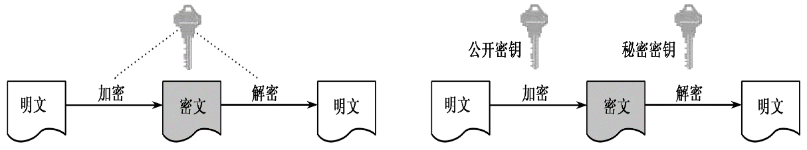

# 金融数据安全

*Author: ZhaoLulu@BJTU*

*Teacher: ZhangDawei@BJTU*

*Date: 2021.9.8*

## 第1章 课程概况

### 1.1 课程简介

金融数据安全是一门专业选修课，目的是使学生掌握在信息技术支撑下的现代金融电子化系统中数据安全所面临的威胁和防护手段，通过理论讲解和案例分析，使学生初步具有设计实现金融电子化系统中数据安全防护系统的能力。

### 1.2 教材与参考资料

- 《Java智能卡原理与应用开发》，电子工业出版社，2008年
- 《Introduction to Modern Cryptography》，CRC Press，2014年
- 《公钥基础设施PKI及其应用》，电子工业出版社，2008年
- 《Bitcoin and Cryptocurrency Technologies》，Princeton，2016年
- https://github.com/hyperledger/fabric
- https://gitee.com/FISCO-BCOS
- https://www.getmonero.org/
- https://z.cash/zh/

### 1.3 教学目标

1. 了解现代信息技术支撑下的金融电子化系统中数据安全所面临的威胁和挑战，掌握金融电子化系统中的数据安全防护的理论、方法和技术手段，使学生具有应用所学知识解决工程实际问题的能力。
2. 深入理解多种金融数据安全系统的设计理念和设计方法，能够分析比较不同方案和技术路线的安全强度和适用性，培养分析和解决工程实践问题的创新意识和创新设计能力。
3. 通过课程实验和案例开发，掌握将设计方案进行实现和部署的能力，从而能够研究和开发复杂安全问题的解决方案。
4. 在实际案例的研究和开发过程中理解金融数据安全同法规遵从的关系，提高学生从业的法律和道德意识，能够在工程实践中遵守专业工程师职业道德和规范，履行社会责任。

### 1.4 教学内容

1. 信息安全的基础知识
2. 金融电子化系统的发展
3. 网络支付系统的安全
4. 移动支付的安全
5. 密码货币的安全
6. 区块链系统的安全

### 1.5 成绩评定

- 总评成绩 = 期末考试70分 + 平时成绩30分

- 期末开卷考试

## 第2章 加密的防护密码学基础

### 2.1 密码学的基本概念

- 明文、密文、密码算法
- 加密、解密

### 2.2 对称密码算法

- DES的加密方案

  1. 2个输入：明文和密钥。
  2. 1个明文分组64bit（8个字节）。
  3. 1个密钥分组56bit（8个字节）其中每一字节最低位为奇偶校验位（奇校验）。
  4. 1个输出：密文64bit（8个字节）。

- 3DES的加密方案

  - 3DES有两种加密方式：两密钥加密、三密钥加密。

  - 两密钥加密：由Tuchman提出，采用”加密-解密-加密“的序列。

  $$
  C = E_{K1}(D_{K2}(E_{K1}(M)))
  $$

  - 三密钥加密：使用三个密钥对明文进行加密。

  $$
  C = E_{K3}(D_{K2}(E_{K1}(M))) \\
  D = D_{K1}(E_{K2}(D_{K3}(C)))
  $$

- 对称密码的加密工作模式
  1. 电码本模式ECB (Electronic Code Book)
  2. 密文分组链接模式CBC (Cipher Block Chaining)
  3. 密文反馈模式CFB (Ciphertext Feedback)
  4. 输出反馈模式OFB (Output Feedback)
  5. 计数器模式CRT (Counter Mode)
